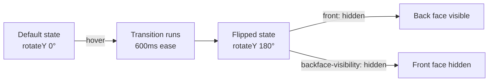
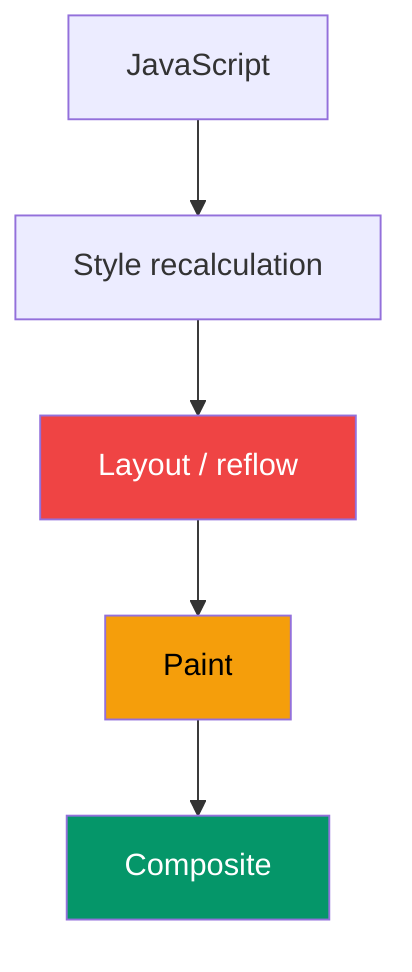

# CSS Transitions

A **transition** smoothly animates a CSS property from one value to another when it changes — most commonly on `:hover`, `:focus`, or a class toggle. You define *what* to animate, *how long*, and *how* the speed curve should feel.

```css
/* Shorthand: property | duration | timing-function | delay */
.button {
  background-color: #059669;
  transition: background-color 200ms ease-in-out;
}

.button:hover {
  background-color: #047857;
}
```

## Animatable properties

Not every CSS property can be transitioned. Properties that require the browser to recalculate layout (`width`, `height`, `margin`, `top`) are expensive. Prefer animating:

| Property | Cost | Why |
| --- | --- | --- |
| `transform` | Cheap | GPU-composited layer |
| `opacity` | Cheap | GPU-composited layer |
| `color`, `background-color` | Medium | Repaint only |
| `width`, `height`, `margin` | Expensive | Full layout reflow |

> [!TIP]
> Use `transform: translateX()` instead of `left` and `transform: scaleX()` instead of `width` whenever possible — it keeps animations on the GPU and stays smooth at 60 fps.

> [!NOTE]
> The `transition` property accepts `all` as the property name, but avoid it — it transitions everything including properties you didn't intend to animate, which wastes work and can cause visual glitches.

## Checklist
- [ ] Understand the four sub-properties of the transition shorthand
- [ ] Know the difference between cheap (transform, opacity) and expensive (width, height) properties to animate
- [ ] Apply a transition to a hover state without using `all`
- [ ] Experiment with `ease`, `ease-in-out`, `linear`, and `cubic-bezier` timing functions
- [ ] Build a smooth button hover and a card lift effect using only `transform` and `box-shadow`

## Further Learning

Search these terms to go deeper:
- **"CSS transitions MDN Web Docs"** — complete reference for all transition properties
- **"cubic-bezier.com"** — interactive tool for designing custom easing curves
- **"Josh W Comeau animation guide"** — practical, visual guide to CSS motion

---

# Keyframe Animations

While transitions react to state changes, `@keyframes` animations run on their own — looping spinners, entrance effects, attention pulses. You define the full timeline from `0%` to `100%`.

```css
@keyframes fade-in {
  from {
    opacity: 0;
    transform: translateY(12px);
  }
  to {
    opacity: 1;
    transform: translateY(0);
  }
}

.card {
  animation: fade-in 300ms ease-out both;
}
```

The `animation` shorthand packs several sub-properties:

```css
.spinner {
  animation:
    spin          /* name */
    800ms         /* duration */
    linear        /* timing */
    infinite      /* iteration-count */
    ;
}

@keyframes spin {
  to { transform: rotate(360deg); }
}
```

> [!IMPORTANT]
> The `animation-fill-mode: both` (or just `both` in the shorthand) tells the browser to apply the `from` styles before the animation starts and hold the `to` styles after it ends. Without it, the element snaps back to its original state the moment the animation finishes.

## Stagger pattern

To stagger multiple elements, apply increasing `animation-delay` values:

```css
.list-item:nth-child(1) { animation-delay: 0ms; }
.list-item:nth-child(2) { animation-delay: 80ms; }
.list-item:nth-child(3) { animation-delay: 160ms; }
```

## Checklist
- [ ] Write a `@keyframes` rule using both `from/to` and percentage stops
- [ ] Apply `animation` shorthand with name, duration, timing, iteration-count, and fill-mode
- [ ] Build a CSS loading spinner using a single rotating element
- [ ] Create a fade-in entrance animation for a card or modal
- [ ] Stagger three list items using `animation-delay`

## Further Learning

Search these terms to go deeper:
- **"CSS animations MDN @keyframes"** — full reference including multi-step keyframes
- **"Animate.css library"** — pre-built keyframe animations you can learn from
- **"Kevin Powell CSS animations YouTube"** — visual walkthroughs of common patterns

---

# Transform & 3D Effects

`transform` is the most versatile tool for UI motion. It moves, rotates, scales, and skews elements without touching layout — and at no additional cost when combined with `transition` or `animation`.

```css
/* Common 2D transforms */
.card:hover {
  transform: translateY(-4px) scale(1.02);
}

/* 3D card flip */
.card-inner {
  transition: transform 600ms ease;
  transform-style: preserve-3d;
}

.card:hover .card-inner {
  transform: rotateY(180deg);
}

.card-front,
.card-back {
  backface-visibility: hidden;
}

.card-back {
  transform: rotateY(180deg);
}
```

The transform pipeline for a 3D flip:



> [!CAUTION]
> Applying `transform` to an element creates a new stacking context. This means `z-index` on child elements behaves relative to the transformed ancestor, not the document root — a common source of tooltip and modal layering bugs.

## Checklist
- [ ] Use `translate`, `rotate`, `scale`, and `skew` transforms independently
- [ ] Combine two transforms in a single `transform:` declaration
- [ ] Understand why `transform` does not trigger layout reflow
- [ ] Build a 3D card flip using `perspective`, `rotateY`, and `backface-visibility`
- [ ] Explain the new stacking context that `transform` creates

## Further Learning

Search these terms to go deeper:
- **"CSS transform MDN"** — all transform functions with live examples
- **"CSS 3D transforms deep dive CSS-Tricks"** — thorough explanation of perspective and backface
- **"transform stacking context explained"** — why z-index behaves unexpectedly with transforms

---

# Performance & Accessibility

Beautiful animations can hurt users if they're janky (frames dropped), excessive (motion sickness), or blocking (long tasks on the main thread). Senior engineers treat animation performance as a first-class concern.

## The compositing pipeline



Animating `transform` and `opacity` only touches the **Composite** step (green). Animating `width` or `top` forces the browser all the way back to **Layout** (red) — every frame.

## `will-change`

```css
/* Hint to the browser: promote this to its own GPU layer */
.modal {
  will-change: transform;
}
```

> [!WARNING]
> `will-change` is easy to over-apply. Every promoted layer consumes GPU memory. Only add it when you've *measured* a jank problem on real devices, and remove it after the animation via JavaScript (`el.style.willChange = 'auto'`).

## Respecting user preferences

```css
@media (prefers-reduced-motion: reduce) {
  *,
  *::before,
  *::after {
    animation-duration: 0.01ms !important;
    animation-iteration-count: 1 !important;
    transition-duration: 0.01ms !important;
  }
}
```

> [!IMPORTANT]
> This media query is not optional. Users who have enabled "Reduce Motion" in their OS have real reasons — vestibular disorders, epilepsy, migraine triggers. Always honour it.

## Checklist
- [ ] Explain why only `transform` and `opacity` are composited properties
- [ ] Use Chrome DevTools Performance panel to identify dropped frames in an animation
- [ ] Apply `will-change` to a specific element and verify it creates a new layer in DevTools Layers panel
- [ ] Add a `prefers-reduced-motion` media query that disables all transitions and animations
- [ ] Decide when to reach for a JavaScript animation library (GSAP, Framer Motion) vs pure CSS

## Further Learning

Search these terms to go deeper:
- **"web.dev rendering performance animations"** — Google's authoritative guide on the compositing pipeline
- **"prefers-reduced-motion MDN"** — browser support, syntax, and testing tips
- **"GSAP vs CSS animations when to use each"** — practical decision guide for complex sequences
- **"Chrome DevTools Layers panel tutorial"** — how to inspect GPU layers and spot will-change misuse
