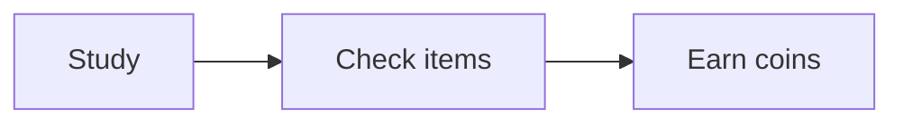

# First Subtopic

Write your theory here using normal markdown. You can use **bold**, lists, tables,
and fenced code blocks:

```js
function greet(name) {
  return `Hello, ${name}`;
}
```

> [!NOTE]
> Callouts work too — try [!TIP], [!WARNING], [!CAUTION], and [!IMPORTANT].

## Checklist
- [ ] First thing to learn
- [ ] Second thing to learn
- [ ] Practice a little

# Second Subtopic

You can also embed diagrams with a ```mermaid block:



## Checklist
- [ ] Understand the diagram
- [ ] Try editing this file and re-uploading
