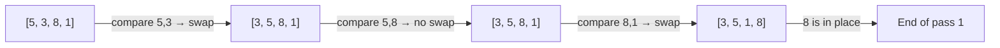

Before diving into efficient sorting algorithms, it helps to understand the simple O(n²) sorts. They're slow on large inputs, but they're easy to reason about, have tiny overhead, and two of them (insertion sort in particular) are still used in practice for small or nearly-sorted arrays.

## Bubble Sort

Bubble sort repeatedly walks through the array, comparing adjacent pairs and swapping them if they're out of order. After each pass, the largest unsorted element "bubbles up" to its correct position at the end.

```ts
function bubbleSort(arr: number[]): number[] {
  const a = [...arr];
  for (let i = 0; i < a.length; i++) {
    let swapped = false;
    for (let j = 0; j < a.length - i - 1; j++) {
      if (a[j] > a[j + 1]) {
        [a[j], a[j + 1]] = [a[j + 1], a[j]];
        swapped = true;
      }
    }
    if (!swapped) break; // already sorted — early exit
  }
  return a;
}
```

### One Pass of Bubble Sort (visualized)



After pass 1, `8` is in its final position. After pass 2, `5` will be. And so on.

> [!NOTE]
> The early-exit optimization (breaking when no swaps occur) makes bubble sort O(n) on already-sorted input — its one practical advantage.

## Selection Sort

Selection sort divides the array into a sorted left portion and an unsorted right portion. On each pass it scans the unsorted portion to find the minimum element, then swaps it into the next sorted position.

```ts
function selectionSort(arr: number[]): number[] {
  const a = [...arr];
  for (let i = 0; i < a.length; i++) {
    let minIdx = i;
    for (let j = i + 1; j < a.length; j++) {
      if (a[j] < a[minIdx]) minIdx = j;
    }
    if (minIdx !== i) [a[i], a[minIdx]] = [a[minIdx], a[i]];
  }
  return a;
}
```

Selection sort always makes exactly n−1 swaps regardless of input order. This makes it useful when writes are expensive (e.g., writing to flash memory) even though it's still O(n²) in time.

## Insertion Sort

Insertion sort builds a sorted sub-array from left to right. For each new element, it slides it left past any elements that are larger, inserting it in the right spot — like sorting playing cards in your hand.

```ts
function insertionSort(arr: number[]): number[] {
  const a = [...arr];
  for (let i = 1; i < a.length; i++) {
    const key = a[i];
    let j = i - 1;
    while (j >= 0 && a[j] > key) {
      a[j + 1] = a[j];
      j--;
    }
    a[j + 1] = key;
  }
  return a;
}
```

> [!TIP]
> Insertion sort is the go-to for small arrays (< ~20 elements). V8 (Node.js's JavaScript engine) uses insertion sort under the hood for small sub-arrays within its TimSort implementation.

## Side-by-Side Complexity

| Algorithm | Best Case | Average Case | Worst Case | Space | Stable? |
|---|---|---|---|---|---|
| Bubble Sort | O(n) | O(n²) | O(n²) | O(1) | Yes |
| Selection Sort | O(n²) | O(n²) | O(n²) | O(1) | No |
| Insertion Sort | O(n) | O(n²) | O(n²) | O(1) | Yes |

**Stable** means equal elements maintain their original relative order — important when you're sorting objects by one field and want to preserve a previous sort on another field.

> [!IMPORTANT]
> None of these are good choices for large, unordered data. Use merge sort or quicksort (covered in the next two lessons) for inputs larger than a few dozen elements.

## When to Use Each

- **Bubble sort** — teaching tool; rarely used in production
- **Selection sort** — when minimizing writes matters more than speed
- **Insertion sort** — small arrays, nearly-sorted data, or as the base case inside faster algorithms

## Further Learning

Search these terms to go deeper:
- **"Visualgo sorting visualizations"** — animated, step-by-step views of all three algorithms
- **"Insertion sort nearly sorted performance"** — explains why O(n) best-case matters in practice
- **"Sorting algorithms comparison geeksforgeeks"** — side-by-side code and analysis
- **"TimSort Python Java sorting"** — the hybrid algorithm that uses insertion sort for small runs
