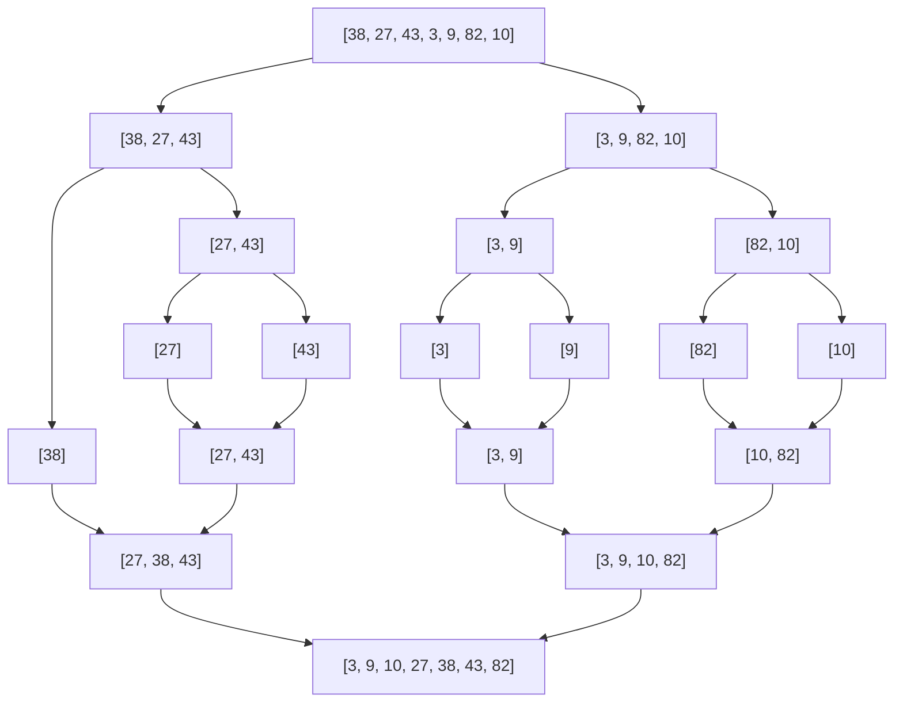

Merge sort is the first "fast" sorting algorithm most developers learn, and it's a beautiful example of the divide-and-conquer strategy. The core insight is simple: splitting a problem in half at every step reduces the depth of work from n to log n, and doing a linear amount of work at each level gives you O(n log n) total.

## Divide and Conquer

The strategy has three steps:
1. **Divide** — split the array into two halves
2. **Conquer** — recursively sort each half
3. **Combine** — merge the two sorted halves into one sorted array

The magic is in the merge step: merging two sorted arrays into one sorted array is O(n). And because we split in half each time, we only need log₂(n) levels of splitting.

## Split and Merge Diagram



> [!NOTE]
> Each level of the diagram represents one "round" of merging. There are log₂(7) ≈ 3 levels, and each level does O(n) total work across all merges. That's why the overall complexity is O(n log n).

## TypeScript Implementation

```ts
function mergeSort(arr: number[]): number[] {
  if (arr.length <= 1) return arr;

  const mid = Math.floor(arr.length / 2);
  const left = mergeSort(arr.slice(0, mid));
  const right = mergeSort(arr.slice(mid));

  return merge(left, right);
}

function merge(left: number[], right: number[]): number[] {
  const result: number[] = [];
  let i = 0;
  let j = 0;

  // Compare heads of both arrays, take the smaller one
  while (i < left.length && j < right.length) {
    if (left[i] <= right[j]) {
      result.push(left[i++]);
    } else {
      result.push(right[j++]);
    }
  }

  // Append whatever remains
  return result.concat(left.slice(i)).concat(right.slice(j));
}
```

## Why O(n log n)?

- The array is split in half at every recursive call, so the recursion depth is **log n**.
- At each level of recursion, we do **O(n)** total work across all merge calls (because every element is visited exactly once per level).
- Total: **O(n) × O(log n) = O(n log n)**.

> [!TIP]
> O(n log n) is the theoretical lower bound for comparison-based sorting. No algorithm that sorts purely by comparing elements can do better in the general case. Merge sort achieves this optimum.

## Stable Sort

Merge sort is **stable**: when two elements are equal, the one that appeared earlier in the input always ends up earlier in the output. Notice the `<=` in the merge step — by favoring the left (earlier) element on ties, we preserve order.

This matters when sorting complex objects. If you sort a list of users by last name and then by first name, a stable sort preserves the last-name order among users who share a first name.

## Space Complexity

The standard implementation above creates new arrays at each merge step, costing **O(n)** extra space. An in-place merge sort exists but is significantly more complex to implement correctly.

> [!IMPORTANT]
> In environments where memory is constrained (embedded systems, very large datasets), the O(n) space cost of merge sort can be a dealbreaker. Quick sort's in-place partitioning (next lesson) may be preferred despite its worse worst-case.

## Further Learning

Search these terms to go deeper:
- **"Merge sort MIT OpenCourseWare 6.006"** — rigorous lecture with recurrence relation proof
- **"Visualgo merge sort animation"** — step-by-step interactive visualization
- **"Merge sort stable sort explanation"** — why stability matters in practice
- **"CLRS Introduction to Algorithms chapter 2.3 merge sort"** — canonical textbook treatment with recurrence analysis
- **"TimSort real-world merge sort"** — the merge sort variant used in Python, Java, and V8
