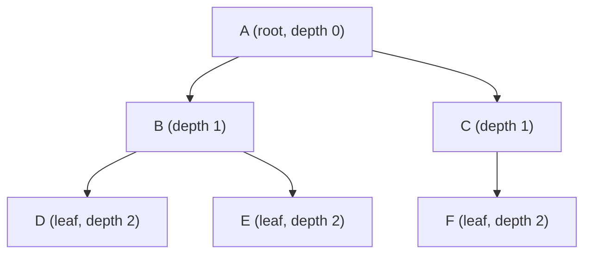
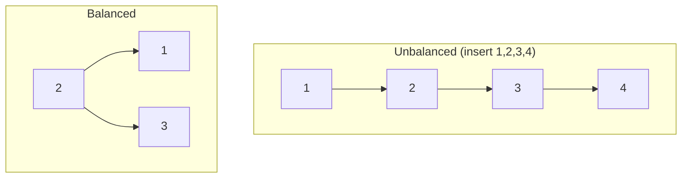

Trees are everywhere in software: the DOM, file systems, JSON, abstract syntax trees in compilers, routing tables, and of course the databases and search indexes that power most applications. Understanding trees — especially the Binary Search Tree — gives you a mental model for an entire class of problems where hierarchical structure or ordered lookup matters.

## Tree Vocabulary



| Term | Definition |
|---|---|
| **Root** | The topmost node — has no parent |
| **Leaf** | A node with no children |
| **Parent / Child** | Relative terms: A is parent of B; B is child of A |
| **Height** | Longest path from root to a leaf (tree above: height = 2) |
| **Depth** | Distance from root to a given node |
| **Subtree** | A node plus all of its descendants |

## Binary Tree vs Binary Search Tree

A **binary tree** is any tree where each node has at most two children, called *left* and *right*.

A **Binary Search Tree (BST)** adds one rule — the **BST property**:
> For every node N, all values in N's left subtree are less than N's value, and all values in N's right subtree are greater than N's value.

This property is what makes lookup efficient: at each node, you can eliminate half the remaining tree.

## BST in TypeScript

```ts
class TreeNode {
  value: number;
  left: TreeNode | null = null;
  right: TreeNode | null = null;

  constructor(value: number) {
    this.value = value;
  }
}

class BST {
  root: TreeNode | null = null;

  insert(value: number): void {
    this.root = this._insert(this.root, value);
  }

  private _insert(node: TreeNode | null, value: number): TreeNode {
    if (node === null) return new TreeNode(value);
    if (value < node.value) {
      node.left = this._insert(node.left, value);
    } else if (value > node.value) {
      node.right = this._insert(node.right, value);
    }
    // equal values: ignore duplicates (or handle per your needs)
    return node;
  }

  search(value: number): boolean {
    return this._search(this.root, value);
  }

  private _search(node: TreeNode | null, value: number): boolean {
    if (node === null) return false;
    if (value === node.value) return true;
    if (value < node.value) return this._search(node.left, value);
    return this._search(node.right, value);
  }
}
```

## Balanced vs Unbalanced BST

The efficiency of BST operations depends entirely on the tree's **height**.

- In a balanced tree, height = O(log n), so insert/search/delete are all O(log n).
- In an unbalanced tree (e.g., inserting sorted data), all nodes go in a single chain, height = O(n), and operations degrade to O(n) — no better than a linked list.



> [!WARNING]
> If you insert values in sorted (or reverse-sorted) order into a BST without balancing, you get a linked list. Always consider whether your data is pre-sorted before choosing a plain BST.

## Self-Balancing Trees

To guarantee O(log n) in all cases, use a self-balancing BST:
- **AVL tree** — rebalances after every insert/delete by tracking height and performing rotations
- **Red-Black tree** — a looser balance guarantee, fewer rotations, used in most production implementations (Java's `TreeMap`, C++'s `std::map`, Linux kernel's scheduling)

You rarely implement these from scratch — knowing they exist and what guarantees they provide is what matters.

> [!NOTE]
> JavaScript's `Map` and `Set` are implemented as hash maps, not BSTs. If you need ordered traversal (iterate keys in sorted order), you'd need a sorted array or a BST. Most languages provide a sorted map (Java's `TreeMap`, C++'s `std::map`) backed by a red-black tree.

## BST Traversal Orders

A BST can be traversed in three orders, each useful for different purposes:
- **In-order (left → root → right)** — visits nodes in sorted ascending order
- **Pre-order (root → left → right)** — useful for copying/serializing the tree
- **Post-order (left → right → root)** — useful for deleting the tree or evaluating expressions

## Further Learning

Search these terms to go deeper:
- **"Binary search tree visualgo animation"** — interactive insert, delete, and search visualization
- **"AVL tree rotations explained"** — how self-balancing works via single and double rotations
- **"Red-black tree vs AVL tree comparison"** — trade-offs between the two most common balanced BSTs
- **"BST inorder traversal iterative"** — important interview problem that tests stack + tree understanding
- **"Segment tree and interval tree applications"** — advanced tree structures for range queries
