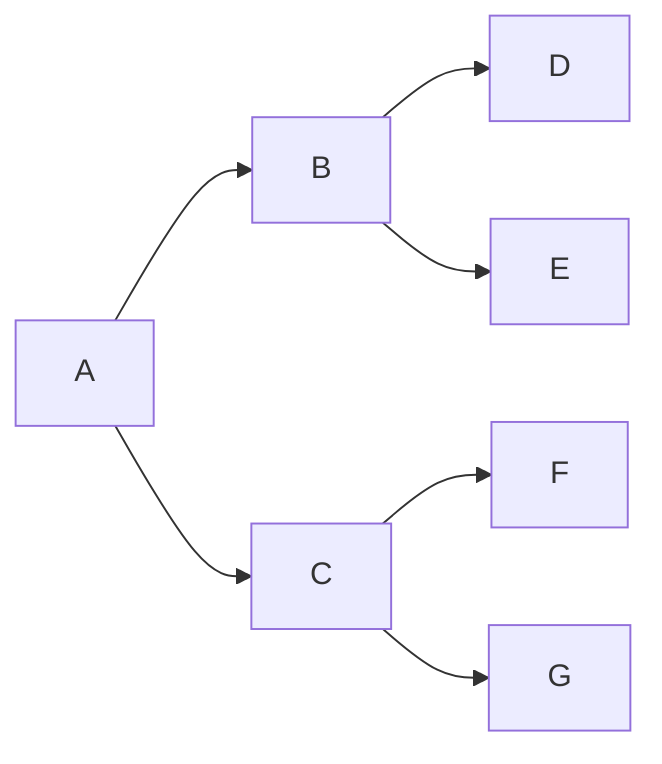

Breadth-First Search (BFS) and Depth-First Search (DFS) are the two fundamental strategies for exploring graphs and trees. Nearly every graph algorithm — shortest paths, connected components, cycle detection, topological sort — is built on top of one of these two traversals. Knowing when to reach for each one is a core interview skill.

## The Graph We'll Use



Both BFS and DFS start at A and visit all reachable nodes — they just visit them in different orders.

## Breadth-First Search (BFS)

BFS explores all neighbors of the current node before going deeper. It uses a **queue** (FIFO): add the start node, then repeatedly dequeue a node, process it, and enqueue its unvisited neighbors.

**BFS visit order on the graph above:** A → B → C → D → E → F → G (level by level)

```ts
type Graph = Map<string, string[]>;

function bfs(graph: Graph, start: string): string[] {
  const visited = new Set<string>();
  const queue: string[] = [start];
  const order: string[] = [];

  visited.add(start);

  while (queue.length > 0) {
    const node = queue.shift()!; // dequeue from front
    order.push(node);

    for (const neighbor of graph.get(node) ?? []) {
      if (!visited.has(neighbor)) {
        visited.add(neighbor);
        queue.push(neighbor); // enqueue at back
      }
    }
  }

  return order;
}
```

> [!TIP]
> BFS finds the **shortest path** (in terms of number of edges) between two nodes in an unweighted graph. Because it explores level by level, the first time it reaches a node is always via the shortest possible route.

## Depth-First Search (DFS)

DFS explores as far as possible along one branch before backtracking. It naturally maps to recursion (using the call stack) or can be done iteratively with an explicit **stack** (LIFO).

**DFS visit order on the graph above (recursive):** A → B → D → E → C → F → G

### Recursive DFS

```ts
function dfsRecursive(
  graph: Graph,
  node: string,
  visited = new Set<string>(),
  order: string[] = []
): string[] {
  visited.add(node);
  order.push(node);

  for (const neighbor of graph.get(node) ?? []) {
    if (!visited.has(neighbor)) {
      dfsRecursive(graph, neighbor, visited, order);
    }
  }

  return order;
}
```

### Iterative DFS (with explicit stack)

```ts
function dfsIterative(graph: Graph, start: string): string[] {
  const visited = new Set<string>();
  const stack: string[] = [start];
  const order: string[] = [];

  while (stack.length > 0) {
    const node = stack.pop()!; // pop from top
    if (visited.has(node)) continue;

    visited.add(node);
    order.push(node);

    // Push neighbors in reverse order so left-to-right processing is preserved
    const neighbors = [...(graph.get(node) ?? [])].reverse();
    for (const neighbor of neighbors) {
      if (!visited.has(neighbor)) stack.push(neighbor);
    }
  }

  return order;
}
```

> [!NOTE]
> The `visited` check placement differs between BFS and iterative DFS. In BFS, mark visited when **enqueued** (prevents duplicates in the queue). In iterative DFS, check when **popped** (simpler to reason about, but nodes may be pushed multiple times — still correct, just slightly less efficient).

## Time and Space Complexity

| Algorithm | Time | Space |
|---|---|---|
| BFS | O(V + E) | O(V) — queue holds up to all nodes |
| DFS | O(V + E) | O(V) — stack/recursion depth up to all nodes |

V = number of vertices (nodes), E = number of edges. Both algorithms visit each node and edge once.

> [!WARNING]
> DFS via recursion can stack overflow on very deep graphs (e.g., a linked list of 100,000 nodes). The iterative DFS with an explicit stack avoids this.

## When to Use Which

| Use BFS when... | Use DFS when... |
|---|---|
| You need the **shortest path** in an unweighted graph | You need to find **any path** from A to B |
| You want to explore level by level | You need to detect **cycles** |
| Target is likely **close** to the start | You need **topological sort** |
| You need the minimum number of steps | You're exploring **all possible paths** |
| Building a **social network distance** query | Solving **mazes** or **puzzles** via backtracking |

> [!IMPORTANT]
> BFS always returns the shortest path in an unweighted graph. If edges have weights, you need Dijkstra's algorithm instead. DFS doesn't find shortest paths — it finds *a* path.

## Further Learning

Search these terms to go deeper:
- **"BFS DFS graph traversal visualgo"** — animated exploration showing visit order
- **"Topological sort DFS Kahn's algorithm"** — two DFS-based approaches to dependency ordering
- **"Dijkstra's algorithm shortest weighted path"** — BFS generalized for weighted edges
- **"Connected components graph DFS"** — using DFS to find isolated subgraphs
- **"Word ladder BFS leetcode"** — classic problem that shows BFS shortest-path in action
