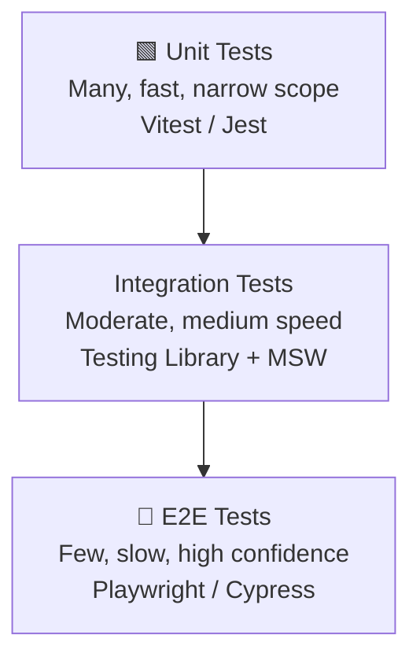
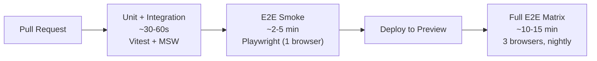

Integration tests verify that multiple units work together correctly. End-to-end (E2E) tests verify that the full application works from the user's perspective, including the real browser, real network, and real DOM. Each layer in the testing pyramid has a cost/confidence tradeoff — understanding that tradeoff lets you invest in the right tests.

## The Test Pyramid



The classic recommendation: many unit tests, fewer integration tests, few E2E tests. The higher you go, the more confidence you get that the system works end-to-end — but the slower, flakier, and more expensive each test becomes.

> [!NOTE]
> Kent C. Dodds's "testing trophy" inverts the triangle slightly, arguing that integration tests (with mocked network) give the best confidence-to-cost ratio and should be the biggest investment.

## Integration Tests with Testing Library and MSW

Mock Service Worker (MSW) intercepts network requests at the Service Worker or Node level, letting your real component code run against a mocked API without changing any production code:

```ts
// handlers.ts
import { http, HttpResponse } from "msw";

export const handlers = [
  http.get("/api/users/:id", ({ params }) => {
    return HttpResponse.json({ id: params.id, name: "Alice" });
  }),
];
```

```ts
// UserProfile.test.tsx
import { render, screen, waitFor } from "@testing-library/react";
import { setupServer } from "msw/node";
import { handlers } from "./handlers";
import { UserProfile } from "./UserProfile";

const server = setupServer(...handlers);
beforeAll(() => server.listen());
afterEach(() => server.resetHandlers());
afterAll(() => server.close());

it("displays the user's name after loading", async () => {
  render(<UserProfile userId="42" />);
  expect(screen.getByText(/loading/i)).toBeInTheDocument();
  await waitFor(() => screen.getByText("Alice"));
});
```

> [!TIP]
> Use `server.use(...)` inside individual tests to override the default handler for error scenarios — test the 500 path without changing the global handler.

## E2E Testing with Playwright

Playwright automates a real browser (Chromium, Firefox, or WebKit). Tests run against the full application stack:

```ts
// tests/login.spec.ts
import { test, expect } from "@playwright/test";

test("user can log in and see their dashboard", async ({ page }) => {
  await page.goto("/login");
  await page.getByLabel("Email").fill("alice@example.com");
  await page.getByLabel("Password").fill("secret");
  await page.getByRole("button", { name: "Sign in" }).click();
  await expect(page).toHaveURL("/dashboard");
  await expect(page.getByRole("heading", { name: "Welcome, Alice" })).toBeVisible();
});
```

Prefer **role-based locators** (`getByRole`, `getByLabel`, `getByText`) over CSS selectors or `data-testid`. They are more resilient to DOM restructuring and double as accessibility audits.

**Key Playwright assertions:**

| Assertion | What it checks |
|---|---|
| `expect(locator).toBeVisible()` | Element exists and is visible |
| `expect(locator).toHaveText("...")` | Exact or substring text match |
| `expect(page).toHaveURL("/path")` | Current URL |
| `expect(locator).toBeChecked()` | Checkbox/radio state |

## Page Object Model

The Page Object Model (POM) abstracts page interactions into a class. This prevents test duplication and isolates breakage when the UI changes:

```ts
// pages/LoginPage.ts
import { Page } from "@playwright/test";

export class LoginPage {
  constructor(private page: Page) {}

  async goto() {
    await this.page.goto("/login");
  }

  async login(email: string, password: string) {
    await this.page.getByLabel("Email").fill(email);
    await this.page.getByLabel("Password").fill(password);
    await this.page.getByRole("button", { name: "Sign in" }).click();
  }
}

// tests/login.spec.ts
test("admin can log in", async ({ page }) => {
  const loginPage = new LoginPage(page);
  await loginPage.goto();
  await loginPage.login("admin@example.com", "password");
  await expect(page).toHaveURL("/admin");
});
```

> [!WARNING]
> E2E tests that share state (cookies, database records) across test files become non-deterministic. Each test should set up and tear down its own data, or use Playwright's `storageState` to snapshot an authenticated session once and reuse it.

## CI Testing Strategy

A practical layered strategy:



- Run unit + integration tests on every commit — they are fast enough to not block the developer
- Run a smoke E2E suite (critical paths only) on every PR before merge
- Run the full cross-browser E2E matrix on a nightly schedule or before production deploys

> [!IMPORTANT]
> Tag slow or external-dependent E2E tests so they can be skipped in the fast path. Playwright supports `test.slow()` and custom tags (`@slow`, `@smoke`) to filter runs per environment.

## Further Learning

Search these terms to go deeper:
- **"Playwright best practices docs"** — official guide covering locators, retries, and parallelism
- **"MSW documentation handlers"** — covers REST and GraphQL handler syntax, lifecycle hooks
- **"Page Object Model Playwright"** — the official POM guide with fixtures integration
- **"testing trophy Kent C Dodds"** — article arguing for integration-heavy test suites
- **"Playwright test sharding CI"** — how to split E2E tests across parallel CI workers to reduce wall-clock time
