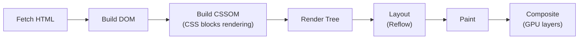

Performance is a feature. A one-second delay in page load time correlates with a 7% reduction in conversions. On mobile networks and low-end devices, the gap between a fast and a slow site translates directly to users abandoning the product. Understanding the mechanics of how browsers fetch, parse, and render lets you diagnose and fix performance problems rather than guessing.

## The Critical Rendering Path

The browser must complete several steps before the user sees anything:



**CSS is render-blocking.** The browser cannot paint until it has built the CSSOM, which requires all stylesheets in `<head>` to be downloaded and parsed. **Parser-blocking JavaScript** (synchronous `<script>` tags) halts HTML parsing entirely until the script executes.

> [!IMPORTANT]
> Every byte in the critical path delays the first paint. The critical path is: initial HTML + CSS needed for above-the-fold content + synchronous JavaScript.

## Eliminating Render-Blocking Resources

```html
<!-- ❌ Blocks parsing -->
<script src="analytics.js"></script>

<!-- ✅ Deferred — runs after HTML is parsed -->
<script src="analytics.js" defer></script>

<!-- ✅ Async — runs as soon as fetched (order not guaranteed) -->
<script src="widget.js" async></script>

<!-- ✅ Preload critical resources early in <head> -->
<link rel="preload" href="/fonts/Inter.woff2" as="font" crossorigin>
```

Use `defer` for scripts that depend on the DOM. Use `async` for truly independent scripts (analytics, chat widgets). Use `preload` for resources you know you will need very soon but the browser would not discover early enough.

> [!TIP]
> `rel="preconnect"` warms up the TCP + TLS handshake to a critical third-party origin before the request. Use it for font providers, API domains, and CDNs: `<link rel="preconnect" href="https://fonts.googleapis.com">`.

## Code Splitting and Lazy Loading

Bundling all JavaScript into one file means users download code for pages they may never visit. Code splitting breaks the bundle at route or component boundaries:

```ts
// Route-level splitting with React.lazy
const Dashboard = React.lazy(() => import("./pages/Dashboard"));
const Settings  = React.lazy(() => import("./pages/Settings"));

// Component-level splitting for heavy components
const RichEditor = React.lazy(() => import("./components/RichEditor"));

// Use Suspense to show a fallback while loading
<Suspense fallback={<Spinner />}>
  <Dashboard />
</Suspense>
```

Vite automatically splits on dynamic `import()`. The initial bundle shrinks; each chunk is loaded on demand.

> [!WARNING]
> Lazy loading introduces a loading state. Always wrap lazy components in `<Suspense>` with a meaningful fallback, and consider skeleton screens over spinners for better perceived performance.

## Image Optimization

Images are typically the largest assets on a page. Unoptimized images are the single most common cause of poor LCP scores.

```html
<!-- Use WebP with a JPEG fallback -->
<picture>
  <source srcset="hero.webp" type="image/webp">
  
</picture>

<!-- Responsive images — serve different sizes to different viewports -->

```

Key rules:
- Use `loading="lazy"` for below-the-fold images; **never** lazy-load the LCP image
- Always set `width` and `height` to prevent layout shift (CLS)
- Use WebP (30–50% smaller than JPEG) with AVIF as a progressive enhancement
- Serve via a CDN with proper `Cache-Control` headers

## Caching Headers

```
# Long-lived cache for hashed assets (JS, CSS)
Cache-Control: public, max-age=31536000, immutable

# Short-lived cache for HTML (so users get new deployments)
Cache-Control: no-cache
```

Modern bundlers (Vite, Webpack) content-hash filenames (`main.a3f9b2.js`). This means you can safely cache them forever — when the content changes, the filename changes and the cache is automatically busted.

## Performance Budget

A performance budget is a set of limits you commit to and enforce in CI:

| Metric | Budget |
|---|---|
| Total JavaScript (compressed) | < 200 KB |
| Total CSS | < 50 KB |
| LCP | < 2.5 s on 4G |
| Total page weight | < 1 MB |

Tools: Bundlesize, Lighthouse CI, and webpack-bundle-analyzer. Fail the build when a budget is exceeded, not just warn.

> [!NOTE]
> The **web.dev performance** site (web.dev/performance) is the authoritative resource for all browser performance topics, written and maintained by the Chrome team.

## Further Learning

Search these terms to go deeper:
- **"web.dev performance"** — Chrome team's comprehensive guide to every performance topic
- **"web.dev critical rendering path"** — detailed walkthrough with diagrams
- **"Lighthouse CI setup"** — automating performance budgets in GitHub Actions
- **"Chrome DevTools Performance panel"** — how to record and read a performance trace
- **"AVIF image format web"** — next-generation image format, 50% smaller than WebP, growing browser support
