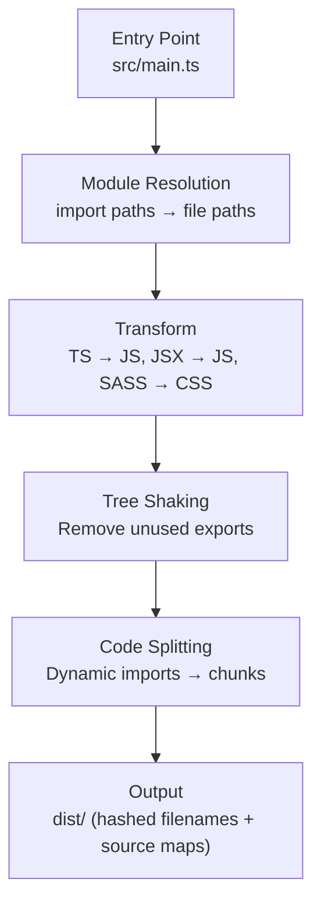

A bundler takes your source files — TypeScript modules, CSS, images, JSON — and transforms them into a set of optimised assets the browser can load. Understanding what happens inside the build lets you diagnose slow builds, bloated bundles, and production-only bugs.

## What a Bundler Does



**Module resolution** follows `import` statements to build a dependency graph. **Tree shaking** removes exports that are never imported (requires ES modules — not CommonJS). **Code splitting** turns dynamic `import()` calls into separate chunks loaded on demand.

## Vite vs Webpack

| Feature | Vite | Webpack |
|---|---|---|
| Dev server | Native ESM — no bundle, instant HMR | Bundles dev too, slower HMR |
| Production build | Rollup under the hood | Webpack runtime |
| Config complexity | Minimal, convention-over-config | Highly configurable |
| Ecosystem maturity | Younger, fast-growing | Mature, vast plugin ecosystem |
| Best for | New projects, React/Vue/Svelte | Legacy projects, complex custom builds |

**Vite config example:**

```ts
// vite.config.ts
import { defineConfig } from "vite";
import react from "@vitejs/plugin-react";

export default defineConfig({
  plugins: [react()],
  build: {
    rollupOptions: {
      output: {
        manualChunks: {
          vendor: ["react", "react-dom"],
        },
      },
    },
  },
});
```

> [!TIP]
> `manualChunks` in Vite's Rollup config lets you split large dependencies (React, chart libraries, editor SDKs) into a separate vendor chunk that clients can cache independently of your app code.

## esbuild

esbuild is a JavaScript/TypeScript bundler written in Go. It is 10–100x faster than Webpack because it parallelises work across CPU cores and avoids the overhead of JavaScript's single-threaded event loop.

Vite uses esbuild for two specific jobs:
1. **Dev-time transpilation** — converting TypeScript and JSX to JS for the browser (per file, no bundling)
2. **Dependency pre-bundling** — converting CJS dependencies to ESM once on startup

Rollup (not esbuild) handles Vite's production bundle because Rollup produces smaller, more optimised output.

> [!NOTE]
> esbuild intentionally skips some TypeScript type checking. It strips types without verifying them. Run `tsc --noEmit` separately in CI to catch type errors.

## Source Maps

Source maps are files (`.map`) that map minified production code back to the original source. They enable readable stack traces in error monitoring tools (Sentry, Datadog) and in the browser DevTools:

```ts
// vite.config.ts
build: {
  sourcemap: true,          // inline or .map files — expose source to browser
  sourcemap: "hidden",      // .map files exist but not referenced from bundle
}
```

Use `"hidden"` in production — upload the `.map` files to your error tracker without serving them publicly, so attackers cannot read your source code.

## Environment Variables

Bundlers replace environment variable references at build time. Only variables with a specific prefix are exposed to the browser bundle (to prevent accidentally leaking server secrets):

```bash
# .env (Vite convention — VITE_ prefix is exposed to the browser)
VITE_API_URL=https://api.example.com
DATABASE_URL=postgres://...   # NOT exposed — no prefix
```

```ts
// In source code
const apiUrl = import.meta.env.VITE_API_URL;
```

> [!WARNING]
> Never put secrets (API keys, private tokens, database credentials) in browser-exposed environment variables. Anything in `VITE_*` or `NEXT_PUBLIC_*` is compiled into your JS bundle and visible to anyone who downloads it.

## Reading Build Output

After `vite build` or `next build`, inspect the output to spot problems:

- **Chunk sizes** — individual JS chunks above ~150 KB compressed deserve investigation
- **Asset hashes** — filenames like `main.a3f9b2.js` confirm cache-busting is working
- **Gzip / Brotli sizes** — `npx vite-bundle-visualizer` or `webpack-bundle-analyzer` shows a treemap of what is inside each chunk

A bloated vendor chunk usually means a heavy library was imported and not tree-shaken. Check for named imports from libraries that only support CJS (which cannot be tree-shaken).

## Further Learning

Search these terms to go deeper:
- **"Vite documentation guide features"** — comprehensive guide to Vite's dev server, plugins, and build options
- **"Rollup tree shaking guide"** — how tree shaking works and why it requires ES modules
- **"esbuild why is it fast"** — esbuild's own explanation of its architecture and design decisions
- **"webpack-bundle-analyzer"** — interactive treemap visualiser for understanding what's in your bundle
- **"web.dev code splitting"** — practical guide to dynamic import and lazy loading patterns
