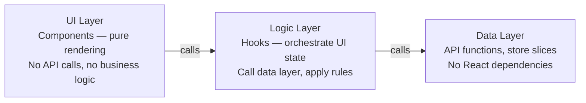

Architecture is the set of decisions that are hard to change later. Frontend architecture answers: how do we organise code so it can grow without becoming a tangle? Where does business logic live? How do teams work in parallel without constantly stepping on each other? The answers depend on scale, team size, and product complexity — but the patterns are reusable.

## Feature-Based Folder Structure

The conventional approach of organising by type (all components in `/components`, all hooks in `/hooks`) breaks down beyond small projects — finding everything related to a feature requires jumping between many directories.

Feature-based organisation collocates everything related to a vertical slice:

```
src/
  features/
    auth/
      components/   LoginForm.tsx, AuthGuard.tsx
      hooks/        useAuth.ts
      api/          auth.api.ts
      store/        auth.slice.ts
      types.ts
      index.ts      (public API — re-exports for external use)
    dashboard/
      ...
  shared/
    components/     Button.tsx, Modal.tsx (no domain knowledge)
    hooks/          useLocalStorage.ts
    utils/          formatDate.ts
  pages/            (or app/ in Next.js)
```

The `index.ts` barrel file acts as the public API of each feature. Other features import from `features/auth`, not from deep internal paths. This enforces boundaries and makes refactoring safer.

> [!TIP]
> Enforce import boundaries with ESLint's `import/no-internal-modules` rule or the **Nx boundary lint rules**. A feature should never directly import from another feature's internals.

## Separation of Concerns

Within a feature, separate three distinct concerns:



A component that fetches its own data, transforms it, and renders it in a single file is hard to test, hard to reuse, and hard to reason about. Splitting these concerns makes each piece independently testable.

## Compound Components

Compound components share implicit state through React context, giving consumers a flexible, expressive API without prop drilling:

```tsx
// Accordion.tsx — compound component implementation
const AccordionContext = React.createContext<{ open: string; toggle: (id: string) => void } | null>(null);

function Accordion({ children }: { children: React.ReactNode }) {
  const [open, setOpen] = React.useState("");
  const toggle = (id: string) => setOpen(prev => prev === id ? "" : id);
  return (
    <AccordionContext.Provider value={{ open, toggle }}>
      <div>{children}</div>
    </AccordionContext.Provider>
  );
}

function Item({ id, title, children }: { id: string; title: string; children: React.ReactNode }) {
  const ctx = React.useContext(AccordionContext)!;
  return (
    <div>
      <button onClick={() => ctx.toggle(id)}>{title}</button>
      {ctx.open === id && <div>{children}</div>}
    </div>
  );
}

Accordion.Item = Item;

// Consumer — reads like prose, no state threading
<Accordion>
  <Accordion.Item id="a" title="Section A">Content A</Accordion.Item>
  <Accordion.Item id="b" title="Section B">Content B</Accordion.Item>
</Accordion>
```

> [!NOTE]
> Compound components are ideal for design system primitives (Tabs, Accordion, Dialog, Select) where the internal state is shared but the layout and content are controlled by the consumer.

## Container / Presenter Pattern

The container/presenter (or smart/dumb) split separates data fetching from rendering:

```tsx
// UserCardContainer.tsx — knows about data, not about pixels
function UserCardContainer({ userId }: { userId: string }) {
  const { data: user, isLoading } = useUser(userId);
  if (isLoading) return <Skeleton />;
  return <UserCard user={user} onFollow={() => followUser(userId)} />;
}

// UserCard.tsx — knows about pixels, not about data sources
function UserCard({ user, onFollow }: { user: User; onFollow: () => void }) {
  return (
    <div>
      
      <h2>{user.name}</h2>
      <button onClick={onFollow}>Follow</button>
    </div>
  );
}
```

`UserCard` is a pure function — easily tested, easily demoed in Storybook, easily composed. The container owns the side effects.

> [!WARNING]
> The container/presenter pattern is not a rigid rule. With custom hooks, you can extract the data logic into a hook (`useUser`) and keep the component relatively presentational without a separate container file. Use whichever structure keeps concerns clear.

## Micro-Frontends

Micro-frontends apply microservice principles to the frontend: different teams own different vertical slices of the UI, each deployable independently. Common approaches:

- **Build-time integration** — separate npm packages composed into a shell app at build time
- **Runtime integration via iframes** — strong isolation, poor UX, hard to share state
- **Module Federation** (Webpack 5 / Vite) — runtime loading of separately deployed JavaScript modules that share dependencies

Use micro-frontends when teams are large and independent enough that a monorepo with feature folders would create too much coordination overhead. For most teams, a well-structured monolith is simpler and faster to work with.

> [!IMPORTANT]
> Micro-frontends add complexity: shared design system versioning, cross-app routing, consistent auth, and bundle duplication. Adopt them for organisational reasons, not technical ones.

## Further Learning

Search these terms to go deeper:
- **"Bulletproof React folder structure"** — practical opinionated guide to feature-based organisation for React apps
- **"compound components pattern React"** — in-depth exploration of the context-sharing pattern
- **"Module Federation Webpack 5"** — official docs for runtime micro-frontend composition
- **"Nx monorepo boundary lint rules"** — enforcing feature boundaries in large codebases
- **"Patterns.dev frontend patterns"** — catalogue of React component and rendering patterns with examples
