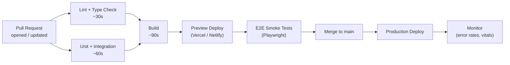

Continuous Integration (CI) automatically verifies every change before it merges. Continuous Deployment (CD) automatically ships verified changes to users. Together they compress the feedback loop, reduce human error, and make shipping a non-event rather than a ceremony.

## GitHub Actions Basics

A workflow is a YAML file in `.github/workflows/`. It triggers on events (push, pull_request), runs jobs in parallel or sequence, and each job runs steps on a runner VM:

```yaml
# .github/workflows/ci.yml
name: CI

on:
  push:
    branches: [main]
  pull_request:

jobs:
  lint-and-test:
    runs-on: ubuntu-latest
    steps:
      - uses: actions/checkout@v4

      - uses: actions/setup-node@v4
        with:
          node-version: 20
          cache: "pnpm"

      - name: Install dependencies
        run: pnpm install --frozen-lockfile

      - name: Type check
        run: pnpm tsc --noEmit

      - name: Lint
        run: pnpm lint

      - name: Unit tests
        run: pnpm vitest run --coverage

      - name: Upload coverage
        uses: actions/upload-artifact@v4
        with:
          name: coverage
          path: coverage/
```

> [!TIP]
> Use `--frozen-lockfile` (pnpm) or `--ci` (npm) in CI to fail fast if the lockfile does not match `package.json` rather than silently updating it.

## Full Frontend CI/CD Pipeline



Jobs that do not depend on each other run in parallel. Use `needs:` to express sequential dependencies:

```yaml
jobs:
  test:
    runs-on: ubuntu-latest
    steps: [...]

  build:
    needs: test
    runs-on: ubuntu-latest
    steps: [...]

  deploy-preview:
    needs: build
    runs-on: ubuntu-latest
    steps: [...]
```

## Environment Variables in CI

Secrets (API keys, deploy tokens) go in GitHub repository or organisation **Secrets**, never in the YAML file:

```yaml
- name: Deploy
  run: vercel deploy --token ${{ secrets.VERCEL_TOKEN }}
  env:
    VITE_API_URL: ${{ vars.API_URL }}   # Non-secret config var
```

- **Secrets** are masked in logs and never exposed to forked PRs by default
- **Variables** (non-secret config) are available to all jobs including forks
- Never print secrets with `echo` — they will appear in logs even though GitHub masks most patterns

> [!WARNING]
> Third-party GitHub Actions from the marketplace run with the same permissions as your workflow. Always pin actions to a specific commit SHA (`uses: actions/checkout@11bd71901bbe5b1630ceea73d27597364c9af68`) rather than a mutable tag (`@v4`) to prevent supply chain attacks.

## Caching Dependencies

Caching node_modules or the pnpm store dramatically reduces CI times:

```yaml
- uses: actions/setup-node@v4
  with:
    node-version: 20
    cache: "pnpm"   # Built-in pnpm cache support

# Or manual cache:
- uses: actions/cache@v4
  with:
    path: ~/.pnpm-store
    key: pnpm-${{ runner.os }}-${{ hashFiles('pnpm-lock.yaml') }}
    restore-keys: pnpm-${{ runner.os }}-
```

The cache key includes the lockfile hash — a lockfile change busts the cache automatically.

## Deployment Strategies

### Blue-Green Deployment

Two identical environments (blue = current, green = new). Deploy to green, run tests, then switch traffic. Instant rollback by switching traffic back to blue:

```
Traffic: 100% → Blue
Deploy to Green → run smoke tests
Switch: 100% → Green
Blue is now standby (instant rollback)
```

### Canary Deployment

Roll new code out to a small percentage of traffic (e.g., 5%), monitor error rates and vitals, then progressively increase:

```
Deploy v2 to 5% of users → monitor for 10 minutes
Expand to 25% → monitor
Expand to 100% → complete
```

Platforms like Vercel, Netlify, and Cloudflare Workers provide canary / gradual rollout natively. Feature flags (LaunchDarkly, Unleash) give you even finer-grained control without a full redeploy.

## Semantic Versioning and Automated Releases

Semantic versioning (`MAJOR.MINOR.PATCH`) signals the nature of a change to consumers. **Changesets** or **semantic-release** automate the version bump and changelog from conventional commit messages:

```bash
# Conventional commits
git commit -m "fix: correct button focus ring on Firefox"     # → patch
git commit -m "feat: add DatePicker component"                # → minor
git commit -m "feat!: rename Button variant prop"             # → major (breaking)
```

The release workflow:

```yaml
- name: Create release
  uses: changesets/action@v1
  with:
    publish: pnpm release
  env:
    GITHUB_TOKEN: ${{ secrets.GITHUB_TOKEN }}
    NPM_TOKEN: ${{ secrets.NPM_TOKEN }}
```

> [!IMPORTANT]
> Tie releases to the `main` branch only. Feature branch builds should produce preview deployments, never versioned releases. The `main` branch should always be production-ready.

## Further Learning

Search these terms to go deeper:
- **"GitHub Actions documentation workflow syntax"** — full reference for triggers, jobs, steps, expressions, and contexts
- **"Changesets GitHub action"** — automated semantic versioning and changelog for monorepos and packages
- **"Vercel preview deployments"** — how per-PR preview URLs work and how to configure them
- **"conventional commits specification"** — the commit message format that powers automated versioning
- **"Playwright GitHub Actions sharding"** — splitting E2E tests across parallel runners to reduce CI wall-clock time
