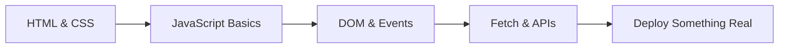

## Where you are right now

This is the very start. Your goal in Phase 1 is simple: build a real web page and put it online. You'll learn the three languages every website is made of:

- **HTML** — the structure (headings, paragraphs, buttons).
- **CSS** — the looks (colors, spacing, layout).
- **JavaScript** — the behavior (things happening when you click).

Don't aim for deep mastery yet — aim for "I can make something that works." Copying tutorials and tweaking them is exactly how you're supposed to learn at this stage. Every working project you build makes the next one easier.

## What makes you "job-ready junior"

Employers here want proof you can *ship* something real: a page that's online, uses the right HTML tags, doesn't break on a phone, and has no red errors in the console. One deployed project beats a stack of certificates.

## What to study in this phase

- [→ **Web Development** › How the Web Works](/topics/web-dev/how-web-works)
- [→ **Web Development** › HTML Semantics](/topics/web-dev/html-semantics)
- [→ **Web Development** › CSS Box Model](/topics/web-dev/css-box-model)
- [→ **Web Development** › Flexbox](/topics/web-dev/flexbox)
- [→ **Web Development** › CSS Grid](/topics/web-dev/grid)
- [→ **Web Development** › Responsive Design](/topics/web-dev/responsive)
- [→ **Web Development** › Events & the Event Loop](/topics/web-dev/events)
- [→ **Web Development** › DOM Manipulation](/topics/web-dev/dom)
- [→ **Web Development** › Fetch API & Async/Await](/topics/web-dev/fetch)
- [→ **JavaScript** › Variables, Types & Coercion](/topics/javascript/types-coercion)
- [→ **JavaScript** › Functions & Scope](/topics/javascript/functions-scope)

## What you should be able to do by the end

- Write clean HTML using the right tags for the job.
- Build a layout that looks fine on both phone and desktop.
- Make something happen on the page when a user clicks or types.
- Load data from the internet with `fetch` and show it.
- Read a console error and know roughly where to look.
- Put your project online (GitHub + Netlify or Vercel).

## Your path

## Want the full version?

Switch to **Expert** mode above for the detailed breakdown of the junior mindset and what employers look for. And check the "Further Learning" resources — The Odin Project and freeCodeCamp are perfect starting points.
