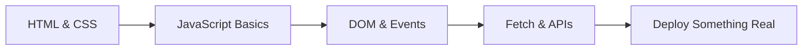

## What defines a Junior Frontend Developer

A junior frontend developer can translate a design or a written description into a working web page. They understand the three foundational languages of the browser — HTML for structure, CSS for appearance, and JavaScript for behaviour — and can combine them to produce something real that users can interact with. At this stage the focus is breadth over depth: you need enough of each technology to get unstuck, follow tutorials confidently, and start building things that work.

The junior mindset is one of pattern recognition and imitation. You study how other developers solve problems, copy the structure, and gradually understand why it works. That is not a weakness — it is exactly how this phase is supposed to go. The goal is to accumulate working mental models for the browser, HTTP, and the DOM so that the next phase, which goes much deeper into JavaScript, feels grounded rather than abstract.

Employers at this level are looking for evidence that you can ship something: a deployed project, clean HTML that uses the right elements for the right purposes, CSS that does not collapse on a narrow screen, and JavaScript that works without errors in the console. A small portfolio of real deployed projects matters more than certificates.

## What to study in this phase

- [→ **Web Development** › How the Web Works](/topics/web-dev/how-web-works)
- [→ **Web Development** › HTML Semantics](/topics/web-dev/html-semantics)
- [→ **Web Development** › CSS Box Model](/topics/web-dev/css-box-model)
- [→ **Web Development** › Flexbox](/topics/web-dev/flexbox)
- [→ **Web Development** › CSS Grid](/topics/web-dev/grid)
- [→ **Web Development** › Responsive Design](/topics/web-dev/responsive)
- [→ **Web Development** › Events & the Event Loop](/topics/web-dev/events)
- [→ **Web Development** › DOM Manipulation](/topics/web-dev/dom)
- [→ **Web Development** › Fetch API & Async/Await](/topics/web-dev/fetch)
- [→ **JavaScript** › Variables, Types & Coercion](/topics/javascript/types-coercion)
- [→ **JavaScript** › Functions & Scope](/topics/javascript/functions-scope)

## Skills to demonstrate

A junior developer at the end of this phase should be able to:

- Write valid, semantic HTML without looking up every element
- Build a responsive multi-column layout using Flexbox or Grid
- Select DOM elements, listen for events, and update the page in response
- Make a `fetch` call, handle the promise, and render the result
- Read a browser console error and know where to start looking
- Open DevTools and use the inspector and network tab to debug problems
- Push code to GitHub and deploy it with a single command or GUI click

## Phase skill map

## Further Learning

Search these terms:

- **"The Odin Project Foundations"** — free, project-based curriculum that starts from zero and takes you through HTML, CSS, and JS with real builds at every step
- **"freeCodeCamp Responsive Web Design"** — hands-on exercises that teach HTML and CSS through building projects directly in the browser
- **"MDN Web Docs Getting Started with the Web"** — the authoritative beginner reference; read the guides alongside any tutorial
- **"Frontend Mentor"** — free design-to-code challenges you can use to build portfolio projects at your current level
- **"JavaScript.info"** — the most thorough beginner-to-intermediate JavaScript tutorial available, completely free
