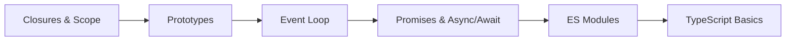

## Where you are right now

Phase 1 was "I can make things happen." Phase 2 is "I understand *why* they happen." This whole stage is about going deeper into **JavaScript** until its quirky bits stop surprising you and start working *for* you.

The big theme is **asynchronous code** — handling data that arrives over time (from a server, a timer, a click). Once Promises and `async/await` click for you, you can confidently deal with slow requests, errors, and keeping the page responsive while it waits.

You'll also meet **TypeScript** here. You don't need to be an expert — just comfortable reading and writing basic typed code. Most teams use it, so the earlier it feels normal, the better.

## What to study in this phase

- [→ **JavaScript** › Variables, Types & Coercion](/topics/javascript/types-coercion)
- [→ **JavaScript** › Functions & Scope](/topics/javascript/functions-scope)
- [→ **JavaScript** › Closures](/topics/javascript/closures)
- [→ **JavaScript** › Prototypes & Classes](/topics/javascript/prototypes-classes)
- [→ **Web Development** › Events & the Event Loop](/topics/web-dev/events)
- [→ **JavaScript** › Promises & async/await](/topics/javascript/promises)
- [→ **JavaScript** › Error Handling](/topics/javascript/error-handling)
- [→ **JavaScript** › Modules (ESM & CJS)](/topics/javascript/modules)
- [→ **JavaScript** › Array Methods](/topics/javascript/array-methods)
- [→ **JavaScript** › TypeScript Basics](/topics/javascript/typescript-basics)
- [→ **Web Development** › Fetch API & Async/Await](/topics/web-dev/fetch)
- [→ **Web Development** › HTTP & REST APIs](/topics/web-dev/http-rest)

## What you should be able to do by the end

- Explain roughly what happens, and in what order, when async code runs.
- Write small, reusable helper functions with good names and error handling.
- Use `map`, `filter`, and `reduce` instead of manual loops.
- Split a project into modules with `import`/`export`.
- Add TypeScript types to a file and fix the errors it points out.

## Your path

## Want the full version?

Switch to **Expert** mode above for the deeper explanation of the junior-to-mid jump. The "Further Learning" picks — JavaScript.info and "You Don't Know JS" — are gold for this phase.
