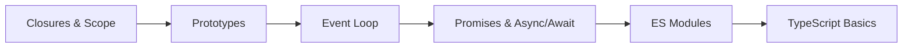

## What defines a Junior–Mid Frontend Developer

The jump from junior to mid-level is almost entirely about JavaScript depth. You move from "I can make things happen" to "I understand why things happen." The language's quirks — type coercion, prototype chains, the event loop, `this` binding — stop being sources of mysterious bugs and start being tools you use deliberately. You also begin writing code that is meant to be read by others, which means thinking about naming, organisation, and error handling rather than just getting something to work.

Asynchronous JavaScript is the defining skill of this phase. Every real web application involves data that arrives over time — from a server, from a timer, from a user. Understanding callbacks, Promises, and async/await at a mechanical level (not just syntactically) means you can reason about what happens when things go wrong, when requests race each other, or when a UI needs to stay responsive while waiting for data.

TypeScript enters the picture here. You do not need to be a TypeScript expert at this stage, but you should be comfortable reading and writing basic typed code: interfaces, generics at a surface level, and the compiler errors that tell you where assumptions are breaking down. Most teams you join will use TypeScript, and the sooner it feels natural the better.

## What to study in this phase

- [→ **JavaScript** › Variables, Types & Coercion](/topics/javascript/types-coercion)
- [→ **JavaScript** › Functions & Scope](/topics/javascript/functions-scope)
- [→ **JavaScript** › Closures](/topics/javascript/closures)
- [→ **JavaScript** › Prototypes & Classes](/topics/javascript/prototypes-classes)
- [→ **Web Development** › Events & the Event Loop](/topics/web-dev/events)
- [→ **JavaScript** › Promises & async/await](/topics/javascript/promises)
- [→ **JavaScript** › Error Handling](/topics/javascript/error-handling)
- [→ **JavaScript** › Modules (ESM & CJS)](/topics/javascript/modules)
- [→ **JavaScript** › Array Methods](/topics/javascript/array-methods)
- [→ **JavaScript** › TypeScript Basics](/topics/javascript/typescript-basics)
- [→ **Web Development** › Fetch API & Async/Await](/topics/web-dev/fetch)
- [→ **Web Development** › HTTP & REST APIs](/topics/web-dev/http-rest)

## Skills to demonstrate

- Explain the event loop and predict the output order of async code snippets
- Write reusable utility functions with consistent error handling and meaningful names
- Use closures intentionally — e.g. a factory function or a memoisation wrapper
- Chain or compose array methods to transform data without mutation
- Add TypeScript annotations to a new file and resolve compiler errors independently
- Debug an async race condition or unhandled rejection using DevTools or console logs
- Explain the difference between `null`, `undefined`, and falsy values to a colleague

## Phase skill map

## Further Learning

Search these terms:

- **"JavaScript.info Promises & Async"** — the clearest free explanation of the async model and its edge cases
- **"You Don't Know JS (YDKJS)"** — Kyle Simpson's free book series; read Scope & Closures and Async & Performance
- **"TypeScript Handbook"** — the official docs are genuinely good; start with Everyday Types and work forward
- **"roadmap.sh/javascript"** — visual checklist of every JS concept worth knowing, with resource links for each
- **"Exercism JavaScript track"** — small, well-specified exercises with mentor feedback; great for deliberate practice
