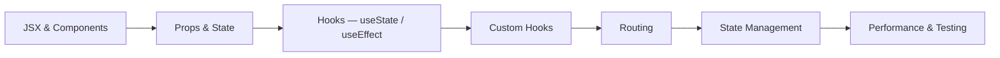

## Where you are right now

Now you learn a **framework** — React — the tool most frontend jobs use to build real apps. The goal of this phase is to become genuinely productive: take a design and turn it into working features with clean components, data loading, and proper handling of loading/error states.

This is also where you start to *own* work end to end: read a design, break it into components, wire up the API, handle the tricky cases, and open a tidy pull request. You're not designing the whole system yet, but you make solid decisions within your slice of it.

The heart of this phase is React's **hooks** — `useState` (for data that changes), `useEffect` (for loading data and side effects), and a few others. Understanding them well — not just the syntax, but *why* your component re-renders — puts you ahead. **Custom hooks** are the payoff: bundle up reusable logic once and share it everywhere.

## What to study in this phase

- [→ **React** › JSX & Components](/topics/react/jsx-components)
- [→ **React** › Props & State](/topics/react/props-state)
- [→ **React** › useState](/topics/react/use-state)
- [→ **React** › useEffect & Lifecycle](/topics/react/use-effect)
- [→ **React** › Events & Forms](/topics/react/events-forms)
- [→ **React** › Lists & Keys](/topics/react/lists-keys)
- [→ **React** › Context API](/topics/react/context)
- [→ **React** › Custom Hooks](/topics/react/custom-hooks)
- [→ **React** › Client-side Routing](/topics/react/routing)
- [→ **React** › State Management Libraries](/topics/react/state-management)
- [→ **React** › React Performance](/topics/react/performance)
- [→ **Frontend Engineering** › Unit Testing](/topics/frontend-engineering/unit-testing)

## What you should be able to do by the end

- Build and ship a full multi-page React app with routing and data fetching.
- Handle the three states of loaded data: loading, error, and empty.
- Pull reusable logic into a custom hook and explain how to use it.
- Decide where a piece of state should live (in one component, shared, or a store).
- Build a form with real validation.
- Spot and fix an unnecessary re-render with React DevTools.

## Your path

## Want the full version?

Switch to **Expert** mode above for the deeper take on mid-level ownership and hooks. The official **react.dev** docs (in "Further Learning") are excellent — work through their tutorial.
