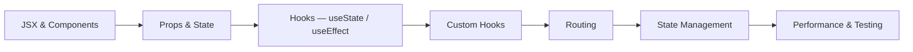

## What defines a Mid-level Frontend Developer

A mid-level developer is productive inside a framework. In the React world that means you can build complete, working features from a design: components that are composed cleanly, state that lives in the right place, data that arrives asynchronously and is displayed with proper loading and error handling. You stop asking "how do I do this in React?" and start asking "what is the right pattern for this problem?"

The transition from junior-mid to mid is also about ownership. You take a feature ticket and deliver it end-to-end — from reading the design, to structuring the components, to wiring in the API call, to handling edge cases, to opening a pull request that is easy to review. You are not yet expected to make architectural decisions for the whole system, but you are expected to make good decisions within your feature.

React's hooks model is the core of this phase. Understanding `useState`, `useEffect`, `useCallback`, and `useMemo` not just syntactically but conceptually — when the closure captures stale values, why the dependency array matters, what causes unnecessary re-renders — puts you ahead of most mid-level developers. Custom hooks are where that understanding becomes a productivity multiplier: you can extract and share logic instead of duplicating it.

## What to study in this phase

- [→ **React** › JSX & Components](/topics/react/jsx-components)
- [→ **React** › Props & State](/topics/react/props-state)
- [→ **React** › useState](/topics/react/use-state)
- [→ **React** › useEffect & Lifecycle](/topics/react/use-effect)
- [→ **React** › Events & Forms](/topics/react/events-forms)
- [→ **React** › Lists & Keys](/topics/react/lists-keys)
- [→ **React** › Context API](/topics/react/context)
- [→ **React** › Custom Hooks](/topics/react/custom-hooks)
- [→ **React** › Client-side Routing](/topics/react/routing)
- [→ **React** › State Management Libraries](/topics/react/state-management)
- [→ **React** › React Performance](/topics/react/performance)
- [→ **Frontend Engineering** › Unit Testing](/topics/frontend-engineering/unit-testing)

## Skills to demonstrate

- Build and ship a complete multi-page React app with routing, data fetching, and error states
- Extract a custom hook and explain its API to a colleague as if writing documentation
- Identify an unnecessary re-render in React DevTools and fix it
- Choose between `useState`, `useReducer`, and a context store for a given feature and explain why
- Write a controlled form with real validation without reaching for a library first
- Read an unfamiliar codebase's component structure and orient yourself within 15 minutes
- Review a peer's component and give constructive feedback on state placement and naming

## Phase skill map

## Further Learning

Search these terms:

- **"React docs react.dev"** — the official docs were rewritten for hooks and are now excellent; work through the full tutorial
- **"Josh W Comeau courses"** — practical, visual explanations of React and CSS that go beyond the basics
- **"TkDodo's Blog on React Query"** — the best practical guide to data fetching patterns in React
- **"Epic React by Kent C. Dodds"** — the most thorough paid React course; the free workshops on GitHub are also worth your time
- **"Frontend Mentor"** — intermediate challenges that require multi-component state, routing, and API integration
