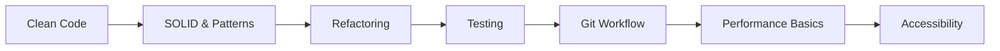

## Where you are right now

This phase isn't about new tech — it's about raising the *quality* of everything you build. The goal: write code other people (including future you) can easily read, test, and change.

The key idea: your code's real audience is the **next developer who reads it**. So you start doing a few things by habit:

- **Writing tests** — so you can change code without fear of breaking it.
- **Keeping functions small** — each one doing a single clear job.
- **Clean names and small pull requests** — because you've felt the pain of the opposite.

Two skills stand out here: **spotting performance problems** (why is this page slow?) and **reviewing code** well. Being able to find a slow spot, fix it, and clearly explain what you did is what earns trust from senior engineers.

## What to study in this phase

- [→ **Software Engineering** › Git Workflow](/topics/software-engineering/git-workflow)
- [→ **Software Engineering** › Clean Code](/topics/software-engineering/clean-code)
- [→ **Software Engineering** › SOLID Principles](/topics/software-engineering/solid)
- [→ **Software Engineering** › Refactoring](/topics/software-engineering/refactoring)
- [→ **Software Engineering** › Code Review](/topics/software-engineering/code-review)
- [→ **Software Engineering** › Testing Philosophy](/topics/software-engineering/testing-philosophy)
- [→ **Frontend Engineering** › Advanced TypeScript](/topics/frontend-engineering/typescript-advanced)
- [→ **Frontend Engineering** › Unit Testing](/topics/frontend-engineering/unit-testing)
- [→ **Frontend Engineering** › Integration & E2E Testing](/topics/frontend-engineering/integration-e2e)
- [→ **Frontend Engineering** › Accessibility (a11y)](/topics/frontend-engineering/accessibility)
- [→ **Frontend Engineering** › Web Performance](/topics/frontend-engineering/web-performance)
- [→ **Frontend Engineering** › Build Tools & Bundlers](/topics/frontend-engineering/build-tools)

## What you should be able to do by the end

- Write tests that give you confidence a module works.
- Break a big messy function into small, single-purpose ones.
- Take PR feedback gracefully, revise, and merge cleanly.
- Use Git comfortably (branches, rebase, bisect).
- Profile a slow interaction and fix it with *data*, not guesses.
- Leave helpful, specific comments on someone else's code.

## Your path

## Want the full version?

Switch to **Expert** mode above for the deeper discussion of engineering habits and the mid-to-senior mindset, plus book recommendations in "Further Learning."
