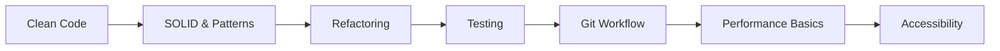

## What defines a Mid–Senior Frontend Developer

The mid-to-senior transition is less about learning new technologies and more about raising the quality floor. A mid–senior developer writes code that is easy for others to read, test, and change. They understand that the primary audience for source code is the next developer who reads it — possibly themselves six months later — and they write accordingly.

This phase is where engineering principles become habits. Clean code, SOLID design, and disciplined Git workflow are not abstract ideals you aspire to — they are the default way you work. You write tests not because a team policy requires them but because you have felt the pain of shipping untested code and debugging it under pressure. You use meaningful names, keep functions small, and break up large pull requests because you have experienced both sides of reviewing code that does and does not have these qualities.

Performance and code review are the two most visible skills at this level. Being able to diagnose a slow interaction, identify its cause (unnecessary renders, large bundles, blocking network requests, reflow-heavy CSS), and fix it — and being able to explain what you did and why in a PR description — is what earns trust with senior engineers and engineering managers.

## What to study in this phase

- [→ **Software Engineering** › Git Workflow](/topics/software-engineering/git-workflow)
- [→ **Software Engineering** › Clean Code](/topics/software-engineering/clean-code)
- [→ **Software Engineering** › SOLID Principles](/topics/software-engineering/solid)
- [→ **Software Engineering** › Refactoring](/topics/software-engineering/refactoring)
- [→ **Software Engineering** › Code Review](/topics/software-engineering/code-review)
- [→ **Software Engineering** › Testing Philosophy](/topics/software-engineering/testing-philosophy)
- [→ **Frontend Engineering** › Advanced TypeScript](/topics/frontend-engineering/typescript-advanced)
- [→ **Frontend Engineering** › Unit Testing](/topics/frontend-engineering/unit-testing)
- [→ **Frontend Engineering** › Integration & E2E Testing](/topics/frontend-engineering/integration-e2e)
- [→ **Frontend Engineering** › Accessibility (a11y)](/topics/frontend-engineering/accessibility)
- [→ **Frontend Engineering** › Web Performance](/topics/frontend-engineering/web-performance)
- [→ **Frontend Engineering** › Build Tools & Bundlers](/topics/frontend-engineering/build-tools)

## Skills to demonstrate

- Write a test suite that gives confidence a module works without over-specifying implementation
- Explain the Single Responsibility Principle with a before/after example from your own code
- Use `git rebase`, `git bisect`, and interactive staging without looking them up
- Profile a slow page interaction and present your findings with data, not intuition
- Write a PR description that explains the why, not just the what
- Improve the accessibility of an existing component and verify it with a screen reader
- Mentor a junior developer through a debugging session by asking questions rather than giving answers

## Phase skill map

## Further Learning

Search these terms:

- **"Clean Code Robert C. Martin"** — the foundational book on writing readable, maintainable code; controversial in places but worth forming your own opinion
- **"roadmap.sh frontend"** — the community frontend roadmap; use it to audit what you know vs what you have gaps in
- **"Google Web Fundamentals Performance"** — practical, measurement-focused performance guidance from the Chrome team
- **"Conventional Commits"** — a lightweight commit message convention that makes git history readable and enables automated changelogs
- **"Testing JavaScript by Kent C. Dodds"** — paid but thorough; the free articles on testing philosophy at kentcdodds.com are essential reading
