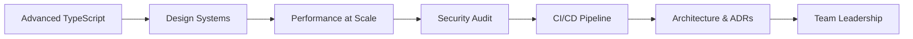

## Where you are right now

A senior developer shapes *how the whole team builds*, not just what they personally build. Your technical skills are deep now — but the thing that really sets you apart is making everyone around you more effective: writing docs so juniors don't ask the same question twice, running code reviews that teach, and pushing back on scope with alternatives.

The new frontier is **architecture** — thinking about the whole system, not just one component. Questions like: Where should the line between client and server be? How do we structure a component library so the whole codebase stays consistent? What's the right data-fetching strategy for our performance budget?

**Security** and **CI/CD** (automated testing + deployment) also become your responsibility. You own the quality of how your team ships — you know what's in the bundle, where the security risks are, and how to roll back if something breaks.

## What to study in this phase

- [→ **Frontend Engineering** › Advanced TypeScript](/topics/frontend-engineering/typescript-advanced)
- [→ **Frontend Engineering** › Integration & E2E Testing](/topics/frontend-engineering/integration-e2e)
- [→ **Frontend Engineering** › Web Performance](/topics/frontend-engineering/web-performance)
- [→ **Frontend Engineering** › Core Web Vitals](/topics/frontend-engineering/core-web-vitals)
- [→ **Frontend Engineering** › Accessibility (a11y)](/topics/frontend-engineering/accessibility)
- [→ **Frontend Engineering** › Design Systems](/topics/frontend-engineering/design-systems)
- [→ **Frontend Engineering** › Frontend Security](/topics/frontend-engineering/security)
- [→ **Frontend Engineering** › CI/CD for Frontend](/topics/frontend-engineering/ci-cd)
- [→ **Frontend Engineering** › Frontend Architecture](/topics/frontend-engineering/architecture)
- [→ **Software Engineering** › Creational Patterns](/topics/software-engineering/design-patterns-creational)
- [→ **Software Engineering** › Structural Patterns](/topics/software-engineering/design-patterns-structural)
- [→ **Software Engineering** › Behavioral Patterns](/topics/software-engineering/design-patterns-behavioral)

## What you should be able to do by the end

- Design a component library other people can build on independently.
- Audit a codebase for security risks and propose fixes.
- Set up automated testing and deployment (CI/CD).
- Write a short document explaining a big technical decision and why you made it.
- Onboard a new teammate and get them productive quickly.
- Lead a technical discussion to an actual decision.

## Your path

## Want the full version?

Switch to **Expert** mode above for the full picture of senior-level architecture and leadership, plus essential resources like the OWASP Top Ten and "Staff Engineer."
