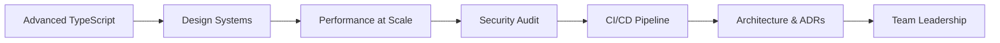

## What defines a Senior Frontend Developer

A senior frontend developer shapes how a team builds, not just what they build. The technical skills are still essential — and at this level they are deep: advanced TypeScript, performance at the system level, security, and the ability to design APIs and systems that scale. But the distinguishing quality of a senior engineer is that they make everyone around them more effective. They write documentation that means junior developers do not need to ask the same questions twice. They lead code reviews that transfer knowledge, not just catch bugs. They push back on scope with data and propose alternatives.

Architecture is the new frontier at this phase. You stop thinking about individual components and start thinking about the system they compose: How do we share state across micro-frontends? What is the right data-fetching strategy for this performance budget? Where should we draw the boundary between client and server? How do we design a component library that is flexible enough for the product team but opinionated enough that the codebase stays consistent? These are the questions you are expected to answer, document, and defend.

Security and CI/CD become non-negotiable at this level. Senior developers own the quality of their team's delivery pipeline — they know what is in the bundle, how it is deployed, where the XSS and CSRF risks live, and what the rollback procedure is. They treat production as a responsibility, not just a destination.

## What to study in this phase

- [→ **Frontend Engineering** › Advanced TypeScript](/topics/frontend-engineering/typescript-advanced)
- [→ **Frontend Engineering** › Integration & E2E Testing](/topics/frontend-engineering/integration-e2e)
- [→ **Frontend Engineering** › Web Performance](/topics/frontend-engineering/web-performance)
- [→ **Frontend Engineering** › Core Web Vitals](/topics/frontend-engineering/core-web-vitals)
- [→ **Frontend Engineering** › Accessibility (a11y)](/topics/frontend-engineering/accessibility)
- [→ **Frontend Engineering** › Design Systems](/topics/frontend-engineering/design-systems)
- [→ **Frontend Engineering** › Frontend Security](/topics/frontend-engineering/security)
- [→ **Frontend Engineering** › CI/CD for Frontend](/topics/frontend-engineering/ci-cd)
- [→ **Frontend Engineering** › Frontend Architecture](/topics/frontend-engineering/architecture)
- [→ **Software Engineering** › Creational Patterns](/topics/software-engineering/design-patterns-creational)
- [→ **Software Engineering** › Structural Patterns](/topics/software-engineering/design-patterns-structural)
- [→ **Software Engineering** › Behavioral Patterns](/topics/software-engineering/design-patterns-behavioral)

## Skills to demonstrate

- Design a token-based design system and explain the decisions that make it extensible
- Write TypeScript generics and conditional types that eliminate an entire category of runtime bugs
- Audit a third-party dependency for security risks and propose a migration or mitigation
- Present a performance regression in a postmortem: timeline, root cause, fix, and prevention
- Write a technical proposal that a non-technical stakeholder can read and approve
- Review an architecture diagram and identify bottlenecks or single points of failure
- Give a junior developer feedback on a pull request that teaches them a principle, not just fixes a line

## Phase skill map

## Further Learning

Search these terms:

- **"roadmap.sh frontend senior"** — the senior-level extension of the frontend roadmap; use it to identify blind spots
- **"web.dev performance"** — Google's structured guide to Core Web Vitals and modern performance techniques
- **"OWASP Top Ten"** — the canonical list of web security risks; every senior frontend developer should know these
- **"Design Systems Handbook"** — free ebook from InVision covering the decisions behind building a scalable component library
- **"Staff Engineer by Will Larson"** — understand what the path beyond senior looks like and how technical leadership actually works
- **"Architecture Decision Records"** — search "ADR GitHub" to find Michael Nygard's original format and dozens of real examples
