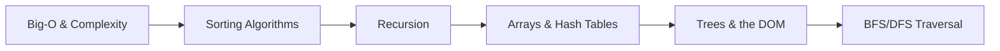

## Why CS fundamentals matter for frontend developers

There is a common belief that frontend developers do not need computer science. You can build impressive things without ever thinking about Big-O or binary trees, and many working developers never do. But CS fundamentals are not about being able to pass interviews at big tech companies — they are about having a vocabulary and a mental toolkit for reasoning about your code's behaviour under pressure.

The moment you wonder why a `filter` followed by a `map` over 50,000 items makes your UI stutter, or why recursively walking a deeply nested object crashes the browser tab, or why the virtual DOM diffing algorithm in React is fast even when the component tree is large — these are CS questions wearing frontend clothes. Knowing Big-O means you can look at a nested loop and immediately know you have a problem. Knowing how trees work means you can read the DOM as a data structure, not a magic black box. Knowing recursion means you can write tree-walking utilities confidently rather than avoiding the pattern.

This is a bonus phase, not a prerequisite for shipping code. Complete the main phases first. But if you want to move from "developer who writes React" to "engineer who understands systems", this is where that foundation lives.

## What to study in this phase

- [→ **CS Fundamentals** › Big-O Notation](/topics/cs-fundamentals/big-o)
- [→ **CS Fundamentals** › Recursion](/topics/cs-fundamentals/recursion)
- [→ **CS Fundamentals** › Bubble, Selection & Insertion Sort](/topics/cs-fundamentals/sorting-basic)
- [→ **CS Fundamentals** › Merge Sort](/topics/cs-fundamentals/merge-sort)
- [→ **CS Fundamentals** › Quick Sort](/topics/cs-fundamentals/quick-sort)
- [→ **CS Fundamentals** › Stacks & Queues](/topics/cs-fundamentals/stacks-queues)
- [→ **CS Fundamentals** › Trees & Binary Search Trees](/topics/cs-fundamentals/trees-bst)
- [→ **CS Fundamentals** › BFS & DFS](/topics/cs-fundamentals/bfs-dfs)
- [→ **Data Structures** › Arrays](/topics/data-structures/arrays)
- [→ **Data Structures** › Linked Lists](/topics/data-structures/linked-lists)
- [→ **Data Structures** › Hash Tables](/topics/data-structures/hash-tables)

## Skills to demonstrate

- Look at a function and state its time and space complexity without running it
- Explain to a colleague why the DOM is a tree and how that determines rendering cost
- Implement a simple BFS function to find all nodes matching a condition in a nested object
- Identify a real frontend performance problem (e.g. slow filter, slow render) and connect it to a CS concept
- Write a recursive function to flatten a nested array and explain the call stack for a small input

## Phase skill map

## Further Learning

Search these terms:

- **"CS50 by Harvard"** — the most watched free CS course in the world; the first four weeks cover all the fundamentals you need
- **"JavaScript Algorithms and Data Structures freeCodeCamp"** — browser-based exercises that apply CS concepts directly in JavaScript
- **"Big-O Cheat Sheet bigocheatsheet.com"** — a single-page reference for the complexity of every common algorithm and data structure operation
- **"Visualgo.net"** — interactive visualisations of sorting algorithms, tree traversal, and graph algorithms that make abstract concepts concrete
- **"Leetcode Easy problems"** — filter to easy, pick array and string problems, and treat them as thinking exercises rather than interview prep
