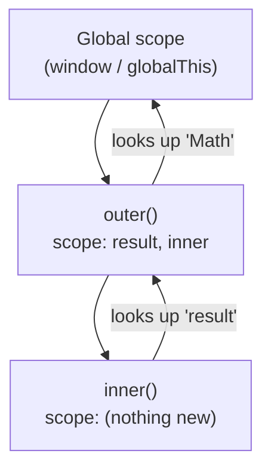

Functions are JavaScript's primary unit of abstraction. Understanding how they interact with scope and `this` removes the guesswork from how variables are found and how `this` gets bound.

## Function Declarations vs Expressions vs Arrow Functions

```ts
// Declaration — hoisted entirely; callable before the line it appears on
function add(a: number, b: number): number {
  return a + b;
}

// Expression — only the variable binding is hoisted (as undefined with var,
// or TDZ with let/const); the function itself is NOT hoisted
const multiply = function (a: number, b: number): number {
  return a * b;
};

// Arrow function — same hoisting as an expression;
// does NOT have its own `this`, `arguments`, or `prototype`
const divide = (a: number, b: number): number => a / b;
```

> [!NOTE]
> Arrow functions are not merely shorthand. They differ from regular functions in three important ways: no own `this`, no `arguments` object, and they cannot be used as constructors.

## Hoisting

JavaScript's engine makes two passes: a compilation pass that records all declarations, then an execution pass. The result:

- `function` **declarations** are hoisted *with their body* — you can call them above their source position.
- `var` **variables** are hoisted as `undefined` — the name exists but has no useful value yet.
- `let` / `const` / `class` are hoisted to the top of their block but stay in the **TDZ** until the declaration line runs.

```ts
greet(); // works — declaration hoisted
function greet() { console.log("hi"); }

console.log(x); // undefined — var hoisted
var x = 5;

console.log(y); // ReferenceError — TDZ
let y = 5;
```

## Lexical Scope and the Scope Chain

JavaScript uses **lexical scope**: which scope a variable belongs to is determined by *where* the code is written, not where it is called. When the engine looks up a name, it searches:

1. The current function's local scope
2. The enclosing function's scope (if any)
3. The next outer scope, continuing outward
4. The global scope



```ts
const result = 10; // global

function outer() {
  const result = 20; // shadows global

  function inner() {
    console.log(result); // 20 — finds it in outer's scope first
  }
  inner();
}
outer();
```

## The `this` Keyword

`this` is not about where a function is written — it is about *how* it is called. There are four binding rules, evaluated in order:

| Call form | `this` binding |
|-----------|---------------|
| `new fn()` | The newly created object |
| `fn.call(ctx)` / `fn.apply(ctx)` / `fn.bind(ctx)` | `ctx` |
| `obj.method()` | `obj` |
| `fn()` (standalone) | `undefined` in strict mode; global object in sloppy mode |

Arrow functions ignore all four rules — they capture `this` from the **surrounding lexical scope** at the time they are defined. This makes them ideal for callbacks that need to access the containing object's `this`.

```ts
class Timer {
  seconds = 0;

  start() {
    // Arrow function: `this` is the Timer instance, always
    setInterval(() => {
      this.seconds++;
    }, 1000);
  }
}
```

> [!WARNING]
> Using a regular function as a `setInterval` / `setTimeout` callback is a classic `this` bug — the callback's `this` will be the global object (or `undefined` in strict mode), not the class instance.

## IIFE (Immediately Invoked Function Expression)

Before `let`/`const` and modules, IIFEs were the standard way to create a private scope and avoid polluting the global namespace:

```ts
(function () {
  const secret = "hidden";
  // `secret` is not accessible outside
})();
```

They are rare in modern code — block scope and ES modules solve the same problem more cleanly — but you will encounter them in older codebases.

## Further Learning

Search these terms to go deeper:
- **"You Don't Know JS: Scope & Closures"** — the definitive treatment of JavaScript's scope model
- **"MDN: this"** — complete reference for all `this` binding modes including edge cases
- **"JavaScript hoisting explained"** — multiple articles on MDN and CSS-Tricks cover this well
- **"lexical scope vs dynamic scope"** — search term for understanding why JS chose lexical scoping
- **"JavaScript IIFE pattern"** — good for understanding pre-module JavaScript codebases
