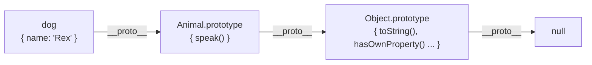

JavaScript's inheritance model is **prototype-based**: objects inherit directly from other objects through a chain of links, not through class blueprints copied at instantiation time. ES6 `class` syntax makes this look familiar to developers coming from Java or Python, but it does not change the underlying mechanism.

## The Prototype Chain

Every object in JavaScript has an internal `[[Prototype]]` slot — accessible as `__proto__` — that points to another object (or `null`). When you read a property on an object, the engine searches:

1. The object itself
2. Its prototype (`__proto__`)
3. The prototype's prototype
4. ... up the chain until `null`



```ts
const animal = {
  speak() {
    return `${this.name} makes a noise.`;
  },
};

const dog = Object.create(animal);
dog.name = "Rex";

dog.speak(); // "Rex makes a noise." — found on animal via prototype chain
dog.hasOwnProperty("name"); // true — found on dog itself
dog.hasOwnProperty("speak"); // false — speak is on the prototype
```

## __proto__ vs .prototype

These two properties confuse many learners because they are different things:

| Property | Lives on | Points to |
|----------|----------|-----------|
| `__proto__` | Every object instance | The object it inherits from |
| `.prototype` | Constructor functions only | The object that will become `__proto__` of instances created with `new` |

```ts
function Animal(name: string) {
  this.name = name;
}
Animal.prototype.speak = function () {
  return `${this.name} makes a noise.`;
};

const dog = new Animal("Rex");
dog.__proto__ === Animal.prototype; // true
```

> [!NOTE]
> `__proto__` is technically a deprecated accessor (defined on `Object.prototype`). The official API is `Object.getPrototypeOf(obj)` and `Object.setPrototypeOf(obj, proto)`. In practice you will see `__proto__` in legacy code and browser consoles.

## ES6 Classes: Syntactic Sugar

ES6 classes provide a cleaner syntax for the same prototype-based inheritance:

```ts
class Animal {
  name: string;

  constructor(name: string) {
    this.name = name;
  }

  speak(): string {
    return `${this.name} makes a noise.`;
  }
}

class Dog extends Animal {
  breed: string;

  constructor(name: string, breed: string) {
    super(name); // must call super before using `this`
    this.breed = breed;
  }

  speak(): string {
    return `${this.name} barks.`; // overrides Animal.speak
  }

  describe(): string {
    return `${super.speak()} It is a ${this.breed}.`;
  }
}

const dog = new Dog("Rex", "Labrador");
dog.speak();    // "Rex barks."
dog.describe(); // "Rex makes a noise. It is a Labrador."

dog instanceof Dog;    // true
dog instanceof Animal; // true — the chain includes Animal.prototype
```

Under the hood, `class Dog extends Animal` sets `Dog.prototype.__proto__ = Animal.prototype`, which is exactly what you would wire up manually with the old constructor pattern.

> [!IMPORTANT]
> In a `constructor` that uses `extends`, you **must** call `super()` before accessing `this`. Doing otherwise throws a `ReferenceError`. This mirrors what happens in the prototype model: the parent constructor runs first to initialise the base properties.

## instanceof

`instanceof` walks the prototype chain of the left operand looking for the `.prototype` of the right operand:

```ts
dog instanceof Dog;          // true
dog instanceof Animal;       // true
dog instanceof Object;       // true — all objects trace back to Object.prototype
[] instanceof Array;         // true
[] instanceof Object;        // true
```

> [!TIP]
> `instanceof` breaks across realms (different iframe windows, worker contexts) because each realm has its own `Array.prototype`. For cross-realm type checks, use `Object.prototype.toString.call(value)` instead.

## Further Learning

Search these terms to go deeper:
- **"You Don't Know JS: this & Object Prototypes"** — the most thorough treatment of prototype chains in JavaScript
- **"MDN: Inheritance and the prototype chain"** — detailed walkthrough with diagrams
- **"JavaScript classes under the hood"** — articles explaining what the class syntax compiles to
- **"Object.create vs new in JavaScript"** — understanding the two main ways to set up prototype chains
- **"JavaScript private class fields"** — the `#field` syntax for truly private instance data
