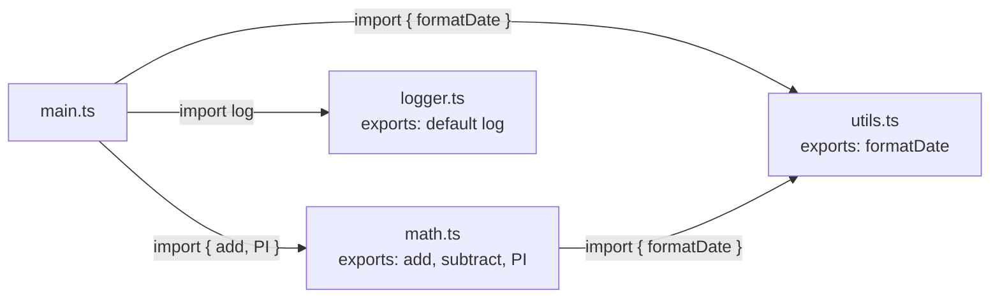

Before modules, every JavaScript file shared the same global scope. A variable named `utils` in one file would silently clash with one in another. **Modules** give each file its own scope, make dependencies explicit, and enable tools to tree-shake unused code.

## Why Modules

The problems modules solve:
- **Name collisions** — top-level variables no longer pollute the global object
- **Load order** — explicit imports make dependency order obvious
- **Encapsulation** — unexported names are truly private to the file
- **Tooling** — bundlers can statically analyse imports and remove unused exports (tree-shaking)

## ESM: Named Exports and Imports

```ts
// math.ts — exporting
export function add(a: number, b: number): number {
  return a + b;
}

export function subtract(a: number, b: number): number {
  return a - b;
}

export const PI = 3.14159;
```

```ts
// main.ts — importing
import { add, PI } from "./math.js";

// Rename on import
import { subtract as sub } from "./math.js";

// Import everything into a namespace object
import * as math from "./math.js";
math.add(1, 2); // 3
```

## ESM: Default Exports

A module can have one default export — the "main thing" the module provides. It is imported without braces and can be given any local name.

```ts
// logger.ts
export default function log(message: string): void {
  console.log(`[LOG] ${message}`);
}
```

```ts
// main.ts
import log from "./logger.js"; // any name works
import myLogger from "./logger.js"; // also fine

log("hello");
```

> [!NOTE]
> Named exports are generally preferred in codebases because they make the name explicit at both the export and import site, improving IDE rename support and grep-ability. Default exports make sense for the "primary" thing in a file (a React component, a class).

## Module Graph



Each edge is an explicit import. The bundler uses this graph to determine what to include and in what order.

## Dynamic import()

Static `import` declarations are resolved at module parse time. `import()` is a function that returns a `Promise` and can be called conditionally or lazily:

```ts
// Only load the heavy chart library when the user opens the chart panel
async function openChartPanel() {
  const { Chart } = await import("./chart.js");
  new Chart(document.getElementById("canvas")!);
}

// Conditional: different modules for different environments
const module = await import(
  process.env.NODE_ENV === "test" ? "./mock-api.js" : "./real-api.js"
);
```

Dynamic imports are the foundation of **code splitting**: instead of one giant bundle, ship smaller chunks that load on demand.

## CommonJS (CJS)

Node.js originally used CommonJS, which you will encounter in older code and many npm packages:

```js
// math.js (CJS)
function add(a, b) { return a + b; }
module.exports = { add };

// OR
exports.add = add;
```

```js
// main.js (CJS)
const { add } = require("./math.js");
const math = require("./math.js"); // the whole exports object
```

### Key differences from ESM

| | ESM | CommonJS |
|--|-----|---------|
| Syntax | `import` / `export` | `require()` / `module.exports` |
| Loading | Static (parsed before execution) | Dynamic (runs on call) |
| `this` at top level | `undefined` | `module.exports` |
| Live bindings | Yes — imported names stay in sync | No — snapshot at require time |
| Tree-shakeable | Yes | No |
| Async top-level | Yes (top-level `await`) | No |

> [!IMPORTANT]
> In Node.js, files are treated as CJS by default. To use ESM, either use `.mjs` extension or add `"type": "module"` to `package.json`. Mixing the two in one project requires care — CJS can `require` CJS, but cannot `require` ESM (use dynamic `import()` instead).

## Browser Support

Browsers have supported ES modules natively since 2018 via `<script type="module">`. In a module script, `import` / `export` work, top-level `await` is available, and the script is deferred by default:

```html
<script type="module" src="./main.js"></script>
```

In practice, most projects still use a bundler (Vite, esbuild, Webpack) for production to combine modules, apply transforms, and optimise chunk sizes.

## Further Learning

Search these terms to go deeper:
- **"MDN: JavaScript modules"** — thorough guide including import maps and module attributes
- **"ES modules: A cartoon deep-dive"** by Lin Clark on hacks.mozilla.org — excellent visual explanation of parsing, instantiation, and evaluation phases
- **"Node.js ESM vs CJS interop"** on the Node.js docs — authoritative guide for mixing the two in one project
- **"Vite code splitting"** — practical guide to dynamic imports and chunk strategy
- **"tree shaking JavaScript"** — how bundlers eliminate dead code through static analysis of ESM imports
