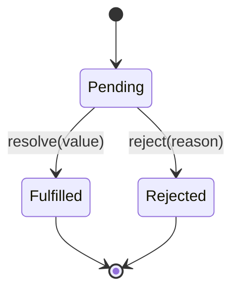

Asynchronous code is at the heart of JavaScript: fetching data, reading files, setting timers. Promises replaced callback hell, and `async/await` made asynchronous code read almost like synchronous code — without blocking the thread.

## Promise States

A `Promise` is an object representing a value that may not be available yet. It is always in exactly one of three states:



Once a Promise transitions from `Pending` to either `Fulfilled` or `Rejected`, it is **settled** — it can never change state again.

## Creating Promises

```ts
function delay(ms: number): Promise<void> {
  return new Promise((resolve) => {
    setTimeout(resolve, ms);
  });
}

function fetchUser(id: number): Promise<{ name: string }> {
  return new Promise((resolve, reject) => {
    if (id <= 0) {
      reject(new Error("Invalid ID"));
      return;
    }
    // Simulate async work
    setTimeout(() => resolve({ name: "Alice" }), 100);
  });
}
```

## .then / .catch / .finally

Each `.then` returns a **new** Promise, enabling chaining. The value returned from a `.then` callback becomes the resolved value of the next Promise in the chain.

```ts
fetchUser(1)
  .then((user) => {
    console.log(user.name); // "Alice"
    return user.name.toUpperCase();
  })
  .then((upper) => {
    console.log(upper); // "ALICE"
  })
  .catch((err) => {
    // Catches rejections from any step above
    console.error(err.message);
  })
  .finally(() => {
    // Runs regardless of success or failure
    console.log("Done");
  });
```

> [!WARNING]
> A `.catch` at the end of a chain only catches errors if they propagate there. An error thrown inside a `.then` that has its own try/catch will not reach the outer `.catch`.

## async/await

`async` functions always return a Promise. Inside them, `await` pauses execution of the function (without blocking the thread) until the awaited Promise settles:

```ts
async function loadProfile(userId: number): Promise<string> {
  try {
    const user = await fetchUser(userId);
    await delay(50); // wait 50ms
    return `Profile: ${user.name}`;
  } catch (err) {
    if (err instanceof Error) {
      throw new Error(`Could not load profile: ${err.message}`);
    }
    throw err;
  }
}
```

> [!NOTE]
> `await` can only appear inside an `async` function (or at the top level of an ES module with top-level await support). Using it elsewhere is a syntax error.

## Promise Coordination

### Promise.all — all must succeed

Runs all Promises concurrently. Resolves when *all* settle with fulfilled, or rejects immediately if *any* rejects.

```ts
const [users, posts] = await Promise.all([
  fetchUsers(),
  fetchPosts(),
]);
// Both fetches ran in parallel
```

### Promise.race — first settled wins

Resolves or rejects as soon as the *first* Promise settles, in either direction.

```ts
// Timeout pattern
const result = await Promise.race([
  fetchData(),
  delay(5000).then(() => { throw new Error("Timeout"); }),
]);
```

### Promise.allSettled — wait for all, never rejects

Resolves with an array of outcome objects — useful when you want all results regardless of individual failures.

```ts
const results = await Promise.allSettled([fetchUser(1), fetchUser(-1)]);

for (const result of results) {
  if (result.status === "fulfilled") {
    console.log(result.value);
  } else {
    console.error(result.reason);
  }
}
```

## Common Async Mistakes

**Floating Promise** — forgetting to `await` or chain `.catch`, causing unhandled rejections:

```ts
// Bug: fetchUser rejection goes unhandled
fetchUser(id); // floating — result and errors ignored

// Fix
await fetchUser(id);
// or
void fetchUser(id).catch(handleError);
```

**Sequential awaits that could be parallel:**

```ts
// Slow: waits for each before starting the next
const a = await fetchA(); // 100ms
const b = await fetchB(); // 100ms after a finishes → total 200ms

// Fast: both start immediately
const [a, b] = await Promise.all([fetchA(), fetchB()]); // ~100ms total
```

> [!CAUTION]
> `async/await` makes code *look* synchronous — this is intentional, but it can mask performance issues. Always ask whether awaits in a loop or in sequence actually need to be sequential.

## Further Learning

Search these terms to go deeper:
- **"MDN: Using Promises"** — thorough guide including microtask queue mechanics
- **"JavaScript Promises: an Introduction"** on web.dev by Jake Archibald — excellent intuition-building article
- **"async/await under the hood"** — articles explaining how async functions compile to generator/state machine code
- **"JavaScript event loop"** — Philip Roberts' "What the heck is the event loop anyway?" (JSConf EU talk) is the canonical starting point
- **"Promise.any and AggregateError"** — the fourth Promise combinator, useful for "first success" patterns
