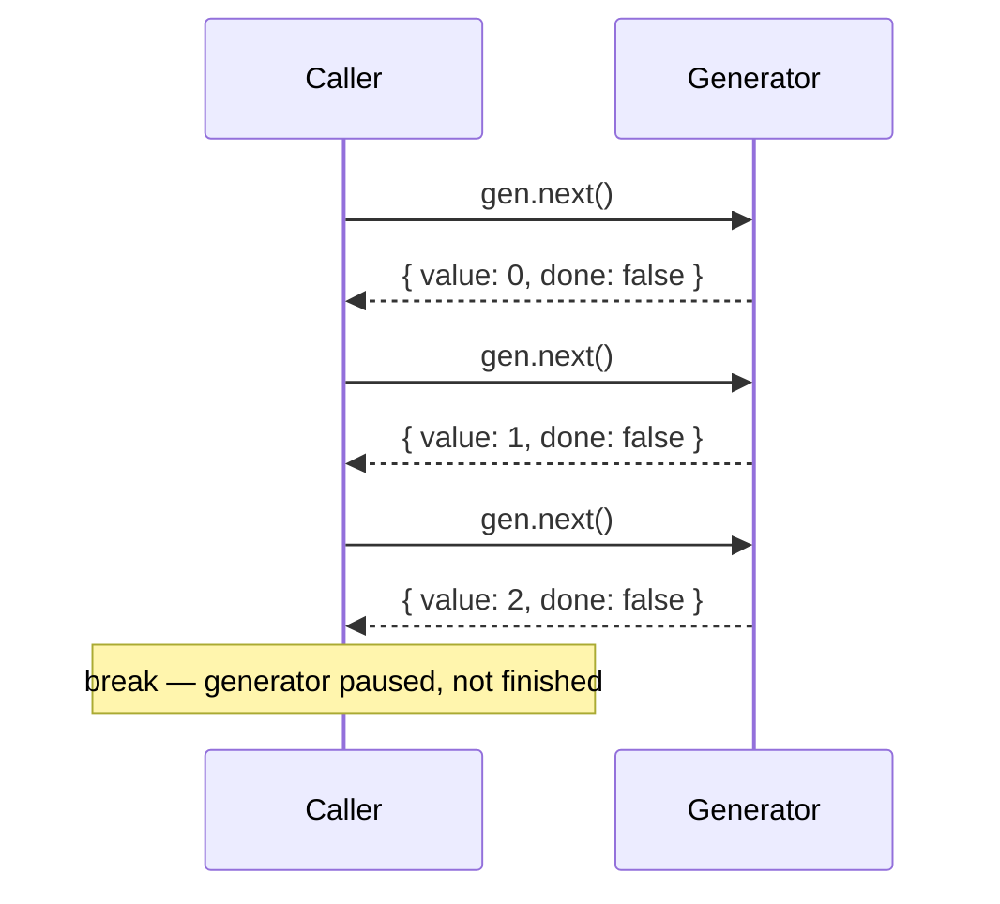

Iterators and generators are two related features that give JavaScript a protocol for lazy, on-demand sequences. Once you understand them, `for...of`, spread, destructuring, and `async`/`await` all become easier to reason about — they all sit on top of this protocol.

## The Iterable Protocol

An object is **iterable** if it has a `[Symbol.iterator]()` method that returns an **iterator**. An iterator is an object with a `next()` method that returns `{ value, done }`:

```ts
// Manually consuming an iterator
const arr = [1, 2, 3];
const iter = arr[Symbol.iterator]();

iter.next(); // { value: 1, done: false }
iter.next(); // { value: 2, done: false }
iter.next(); // { value: 3, done: false }
iter.next(); // { value: undefined, done: true }
```

Built-in iterables include: `Array`, `String`, `Map`, `Set`, `arguments`, `NodeList`, generator objects, and anything returned by `Array.prototype.entries()` / `.keys()` / `.values()`.

`for...of` simply calls `[Symbol.iterator]()` and repeatedly calls `next()` until `done: true`:

```ts
for (const n of [1, 2, 3]) {
  console.log(n); // 1, 2, 3
}

// Also works on strings (iterates over Unicode code points, not UTF-16 units)
for (const ch of "hello") {
  console.log(ch); // h, e, l, l, o
}
```

## Custom Iterables

```ts
class Range {
  constructor(
    private readonly start: number,
    private readonly end: number
  ) {}

  [Symbol.iterator](): Iterator<number> {
    let current = this.start;
    const end = this.end;

    return {
      next(): IteratorResult<number> {
        if (current <= end) {
          return { value: current++, done: false };
        }
        return { value: undefined as unknown as number, done: true };
      },
    };
  }
}

const range = new Range(1, 5);

for (const n of range) {
  console.log(n); // 1, 2, 3, 4, 5
}

const arr = [...range]; // [1, 2, 3, 4, 5]
const [first, second] = range; // destructuring works too
```

> [!TIP]
> If your class should be iterable, also make the iterator return itself from its own `[Symbol.iterator]()`. This makes both the iterable and the iterator work in `for...of` interchangeably — it is called making the iterator "iterable-iterator".

## Generator Functions

Writing custom iterators by hand is verbose. Generator functions (`function*`) automate this — they return a generator object that implements both the iterator and iterable protocols:

```ts
function* count(start: number, end: number): Generator<number> {
  for (let i = start; i <= end; i++) {
    yield i; // pause here, hand `i` to the caller, resume next time
  }
}

const gen = count(1, 3);
gen.next(); // { value: 1, done: false }
gen.next(); // { value: 2, done: false }
gen.next(); // { value: 3, done: false }
gen.next(); // { value: undefined, done: true }

for (const n of count(1, 3)) {
  console.log(n); // 1, 2, 3
}
```

The generator function body is not executed when called — it returns a generator. The body runs only when `next()` is called, pausing at each `yield`.

## Infinite Lazy Sequences

Because generators produce values one at a time, they can represent infinite sequences without consuming infinite memory:

```ts
function* naturals(): Generator<number> {
  let n = 0;
  while (true) {
    yield n++;
  }
}

function* take<T>(n: number, iter: Iterable<T>): Generator<T> {
  let count = 0;
  for (const value of iter) {
    if (count++ >= n) break;
    yield value;
  }
}

const first10 = [...take(10, naturals())]; // [0, 1, 2, 3, 4, 5, 6, 7, 8, 9]
```



## Passing Values Back In

`yield` is an expression — the value passed to `next(value)` becomes the result of the `yield` expression inside the generator. This enables two-way communication:

```ts
function* dialog(): Generator<string, void, string> {
  const name = yield "What is your name?";
  const colour = yield `Hello ${name}! What is your favourite colour?`;
  yield `${name} likes ${colour}.`;
}

const d = dialog();
console.log(d.next().value);        // "What is your name?"
console.log(d.next("Alice").value); // "Hello Alice! What is your favourite colour?"
console.log(d.next("green").value); // "Alice likes green."
```

> [!NOTE]
> The first `next()` call cannot pass a value to the generator — it starts execution from the top of the function, where there is no `yield` expression yet to receive a value.

## Practical Use Cases

- **Paginated API fetching** — yield one page at a time, fetch the next only when needed
- **Stream processing** — process large files line by line without loading everything into memory
- **State machines** — each yield represents a state; the driver passes events back in
- **Redux-Saga** — uses generators to express complex async workflows as a sequence of declarative effects

> [!CAUTION]
> Generators were (and still are) used to implement async/await in transpilers. While understanding this is valuable, prefer `async/await` for async logic in production code — it is clearer and better supported by debuggers.

## Further Learning

Search these terms to go deeper:
- **"MDN: Iteration protocols"** — the formal spec for the iterable and iterator protocols
- **"MDN: function*"** — generator function reference including return values and throw()
- **"JavaScript generators explained"** — Axel Rauschmayer's exploringjs.com has an exhaustive chapter on generators
- **"Lazy evaluation JavaScript generators"** — articles on using generators for memory-efficient data pipelines
- **"Redux-Saga"** — real-world library that builds an entire async middleware system on top of generators
