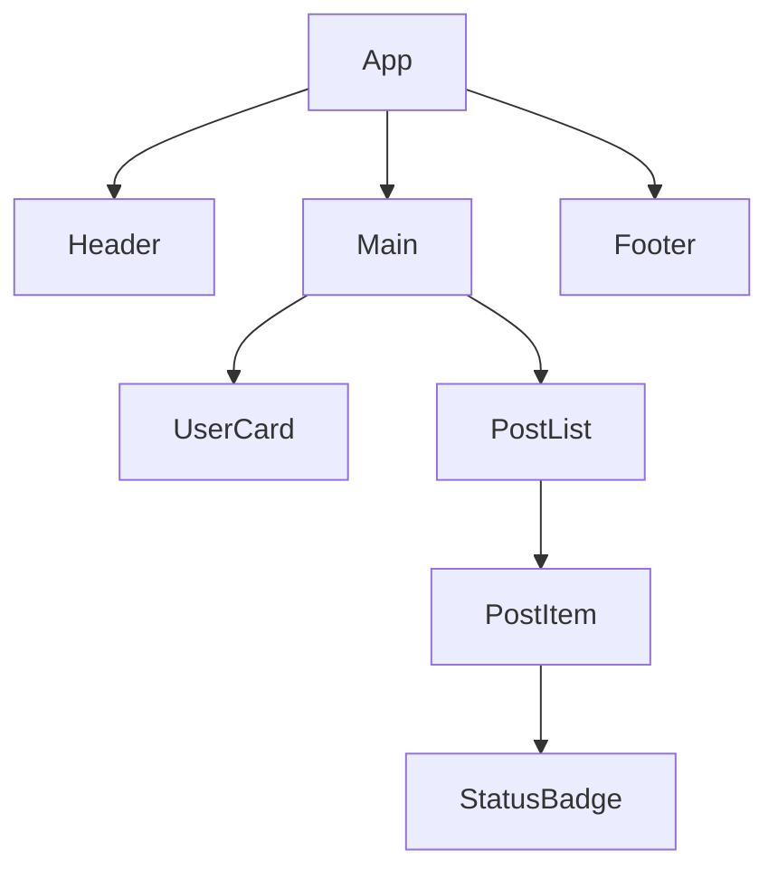

JSX is the syntax extension that makes React code readable. It looks like HTML written inside JavaScript, but it is neither — it is a compile-time transformation that converts angle-bracket syntax into `React.createElement` calls. Understanding what JSX compiles to is the single clearest way to stop being surprised by React's behavior.

## What JSX Actually Is

When you write JSX, a build tool (Vite, Babel, the TypeScript compiler) rewrites it before the browser ever sees it. This transformation is called the "JSX transform."

```tsx
// What you write
function Greeting() {
  return <h1 className="title">Hello, world!</h1>;
}

// What the compiler produces (React 17+ automatic transform)
import { jsx as _jsx } from "react/jsx-runtime";
function Greeting() {
  return _jsx("h1", { className: "title", children: "Hello, world!" });
}
```

Two things to notice: `class` becomes `className` (because `class` is a reserved word in JavaScript), and the result is a plain function call that returns a JavaScript object — a **React element** — describing what should appear on screen.

## Function Components

A React component is a function that accepts a single argument (called `props`) and returns JSX (or `null`).

```tsx
function UserCard({ name, role }: { name: string; role: string }) {
  return (
    <div className="card">
      <h2>{name}</h2>
      <p>{role}</p>
    </div>
  );
}
```

**Component naming must start with a capital letter.** React uses this to distinguish components from native HTML elements. `<div>` is a string; `<UserCard>` is a function React will call.

## Fragments

Components can only return one root element. When you need siblings without a wrapping `<div>`, use a fragment.

```tsx
function Meta() {
  return (
    <>
      <title>My App</title>
      <meta name="description" content="A great app" />
    </>
  );
}
```

`<>...</>` is shorthand for `<React.Fragment>...</React.Fragment>`. Use the long form when you need to pass a `key` prop (for lists).

## Expressions in JSX

Curly braces `{}` let you drop any JavaScript expression into JSX. Statements (like `if` or `for`) don't work directly — use ternaries or logical operators instead.

```tsx
function StatusBadge({ isOnline }: { isOnline: boolean }) {
  return (
    <span className={isOnline ? "badge--green" : "badge--gray"}>
      {isOnline ? "Online" : "Offline"}
    </span>
  );
}
```

> [!NOTE]
> `0` is a falsy value that **does** render in JSX. Writing `{count && <Badge />}` will render a `0` on screen when `count` is zero. Prefer `{count > 0 && <Badge />}` or a ternary.

## Self-Closing Tags

In JSX, any element without children **must** be self-closed. This applies to HTML void elements as well as components:

```tsx
// Correct
<input type="text" />

<MyComponent />

// Syntax error in JSX
<input type="text">
```

## Component Tree



Every React application is a tree of components. React renders from the root down, calling each component function to get its JSX, then recursively rendering the components within that JSX.

## Further Learning

Search these terms to go deeper:
- **"React JSX in depth react.dev"** — the official explanation of how JSX transforms work and every JSX rule
- **"React.createElement deep dive"** — understanding the element object React produces
- **"Josh W. Comeau joy of react components"** — excellent visual explanations of the component model
- **"TypeScript function component typing"** — patterns for typing props with `FC` vs plain function signatures
- **"React fragment key prop list"** — when and why to use the long-form fragment syntax
