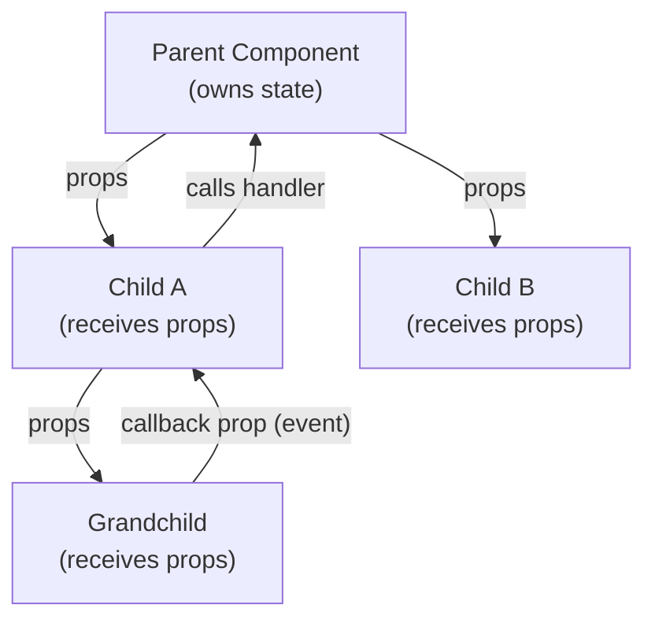

Props and state are the two sources of data in a React component. Understanding both — and understanding why they are fundamentally different — is the foundation for every React pattern that follows.

## Props: Inputs to a Component

Props (short for "properties") are the arguments you pass to a component when you render it. They flow **from parent to child**, and a component must never modify its own props.

```tsx
type ButtonProps = {
  label: string;
  variant?: "primary" | "secondary";
  onClick: () => void;
};

function Button({ label, variant = "primary", onClick }: ButtonProps) {
  return (
    <button className={`btn btn--${variant}`} onClick={onClick}>
      {label}
    </button>
  );
}

// Usage
<Button label="Save" onClick={handleSave} />
<Button label="Cancel" variant="secondary" onClick={handleCancel} />
```

Destructuring props directly in the function signature (`{ label, variant = "primary", onClick }`) is idiomatic React. The `= "primary"` syntax provides a default value for the optional `variant` prop.

> [!IMPORTANT]
> Props are **read-only**. A component that mutates its props breaks the contract React relies on to track changes efficiently. If you need to transform a prop, compute a new value — don't mutate the prop itself.

## Passing Any Type as a Prop

Props are not limited to strings and numbers. You can pass functions, objects, arrays, other React elements, or even components.

```tsx
type CardProps = {
  title: string;
  children: React.ReactNode; // anything React can render
  renderFooter?: () => React.ReactNode; // render prop pattern
};

function Card({ title, children, renderFooter }: CardProps) {
  return (
    <div className="card">
      <h2>{title}</h2>
      <div className="card__body">{children}</div>
      {renderFooter && <footer>{renderFooter()}</footer>}
    </div>
  );
}
```

The special `children` prop receives whatever is placed between a component's opening and closing tags.

## State: Memory Inside a Component

State is data that belongs to a component and can change over time. When state changes, React re-renders the component to reflect the new value. Props cannot change during a component's lifetime (from that component's perspective); state can.

```tsx
// Without state — the count variable resets on every render
function BrokenCounter() {
  let count = 0;
  return <button onClick={() => count++}>{count}</button>; // never updates
}

// With state — React tracks the value between renders
import { useState } from "react";

function Counter() {
  const [count, setCount] = useState(0);
  return <button onClick={() => setCount(count + 1)}>{count}</button>;
}
```

The broken version increments a local variable, but since React has no way to know it changed, it never re-renders. State hands that responsibility to React.

## One-Way Data Flow



Data flows **down** through props. Events and callbacks flow **up** — a child calls a function passed to it as a prop, which triggers a state update in the parent, which re-renders the tree. This single direction makes data easy to trace and debug.

## Props vs State: How to Decide

| Question | Answer |
|---|---|
| Does it come from outside the component? | Props |
| Does it change over time (user interaction, timer, fetch)? | State |
| Can you compute it from existing props or state? | Neither — derive it |
| Does every instance of this component need its own copy? | State per instance |
| Is it shared across many components? | Lift to a common ancestor |

> [!TIP]
> Before reaching for state, ask: "Can I derive this from something I already have?" Derived values (e.g., `const isValid = email.includes("@")`) should be plain variables, not state. Redundant state is a source of bugs.

## Further Learning

Search these terms to go deeper:
- **"Thinking in React react.dev"** — the canonical guide to identifying state, where to put it, and one-way data flow
- **"Kent C. Dodds application state management"** — patterns for deciding where state should live
- **"React children prop patterns"** — everything you can do with the `children` prop
- **"TypeScript React props typing guide"** — exhaustive patterns for typing component props
- **"Lifting state up react.dev"** — the official tutorial on sharing state between siblings
