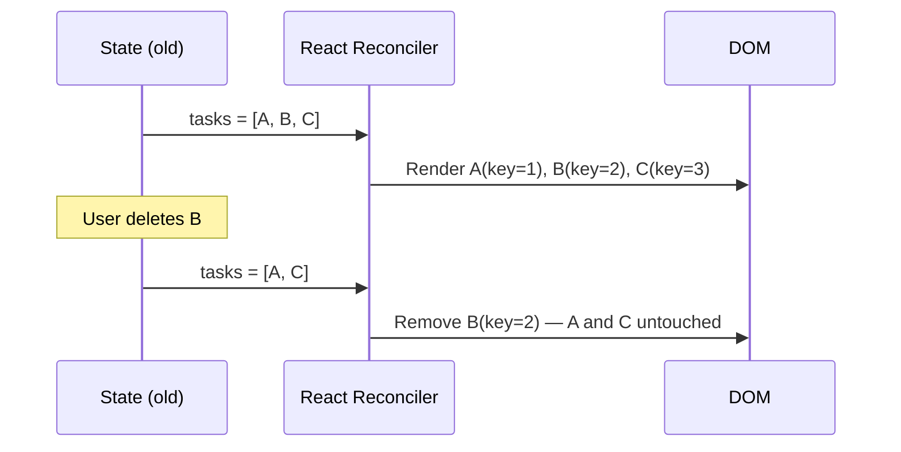

Rendering lists is one of the most common tasks in React UI work. React's reconciliation algorithm uses `key` props to efficiently update lists — getting keys wrong leads to subtle bugs and broken animations.

## Rendering Lists with .map()

The standard way to render a list in React is to call `.map()` on an array inside JSX. Each call to `.map()` should return a JSX element.

```tsx
type Task = { id: string; title: string; done: boolean };

function TaskList({ tasks }: { tasks: Task[] }) {
  return (
    <ul>
      {tasks.map(task => (
        <li key={task.id} className={task.done ? "done" : ""}>
          {task.title}
        </li>
      ))}
    </ul>
  );
}
```

The `key` prop must be placed on the **outermost element returned from map** — in this case the `<li>`, not any element inside it.

## Why Keys Are Required

When React re-renders a list, it needs to know which items changed, which were added, and which were removed. Without keys, React compares elements by their position in the array — any reorder, insertion, or deletion forces a full re-render of all subsequent items.

With keys, React identifies each element by a stable identity and only updates the DOM nodes that actually changed.



Without keys, deleting B would cause React to update B's DOM node to look like C and remove the last node — wasteful and incorrect for stateful elements (inputs, animations).

## Choosing Good Keys

Keys must be:
- **Unique** among siblings (not globally unique)
- **Stable** across renders
- **Not based on render-time computations** (like `Math.random()`)

```tsx
// Good: database IDs are stable and unique
tasks.map(task => <TaskRow key={task.id} task={task} />)

// Good: slug from content
posts.map(post => <PostCard key={post.slug} post={post} />)

// Problematic: see below
tasks.map((task, index) => <TaskRow key={index} task={task} />)
```

## When Index Keys Cause Bugs

Using array index as a key is only safe when the list is **static** (no reorders, no inserts, no deletes) and items have no state of their own.

The bug appears when items are reordered or inserted:

```tsx
// If you insert a task at position 0, every key shifts by 1
// React reuses the DOM node at position 0 but assigns new props —
// any uncontrolled input inside that node retains the old value
tasks.map((task, index) => <TaskRow key={index} task={task} />)
```

> [!CAUTION]
> If list items contain inputs, animations, or any component state, and the list can be sorted or filtered, index keys will produce incorrect behavior. Always prefer a stable data ID.

## Filtering and Transforming Before Rendering

You can chain array methods before `.map()` to filter or sort:

```tsx
function ActiveTaskList({ tasks }: { tasks: Task[] }) {
  return (
    <ul>
      {tasks
        .filter(task => !task.done)
        .sort((a, b) => a.title.localeCompare(b.title))
        .map(task => (
          <li key={task.id}>{task.title}</li>
        ))}
    </ul>
  );
}
```

> [!NOTE]
> `.sort()` mutates the original array. If `tasks` comes from state, spread it first: `[...tasks].sort(...)`. Mutating state directly bypasses React's change detection.

## Rendering Lists of Components

The same pattern applies when each item renders a full component:

```tsx
function ProductGrid({ products }: { products: Product[] }) {
  return (
    <div className="grid">
      {products.map(product => (
        <ProductCard
          key={product.id}
          name={product.name}
          price={product.price}
          imageUrl={product.imageUrl}
        />
      ))}
    </div>
  );
}
```

The `key` is used by React internally — it is not passed as a prop to `ProductCard`. If you need to access it inside the component, pass it explicitly as a separate prop.

## Further Learning

Search these terms to go deeper:
- **"React reconciliation keys react.dev"** — the official explanation of how React's diffing algorithm uses keys
- **"why index as key is an antipattern Robin Pokorny"** — the original article explaining the bug with index keys
- **"React list rendering performance"** — when large lists need virtualization (react-window, TanStack Virtual)
- **"Kent C. Dodds React key prop"** — using key as a reset mechanism (intentional remounting)
- **"react-window react-virtual large lists"** — libraries for efficiently rendering thousands of items
