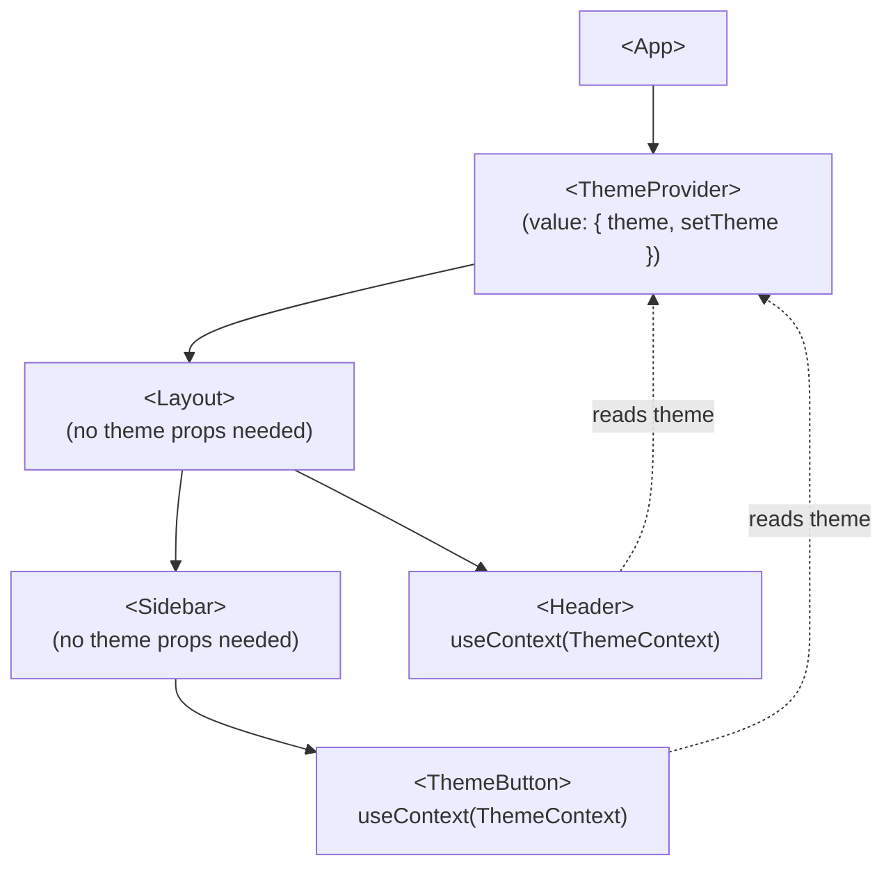

The Context API solves a specific problem: passing data through many layers of components without manually threading props through every intermediate component — a problem known as "prop drilling." Context is not a general-purpose state management solution, but it is the right tool for data that is truly global to a subtree.

## Prop Drilling: The Problem Context Solves

```tsx
// Without context: `theme` must be passed through every component that doesn't use it
function App() {
  const [theme, setTheme] = useState<"light" | "dark">("light");
  return <Layout theme={theme} setTheme={setTheme} />;
}
function Layout({ theme, setTheme }: ...) {
  return <Sidebar theme={theme} setTheme={setTheme} />;
}
function Sidebar({ theme, setTheme }: ...) {
  return <ThemeButton theme={theme} setTheme={setTheme} />;
}
// ThemeButton is the only component that actually needs these props
```

With context, `ThemeButton` reads the value directly without `Layout` or `Sidebar` ever knowing about it.

## Creating and Using Context

```tsx
import { createContext, useContext, useState } from "react";

type ThemeContextValue = {
  theme: "light" | "dark";
  setTheme: (t: "light" | "dark") => void;
};

// 1. Create the context with a default value (used when no Provider is above)
const ThemeContext = createContext<ThemeContextValue>({
  theme: "light",
  setTheme: () => {},
});

// 2. Build a Provider component to wrap the subtree
function ThemeProvider({ children }: { children: React.ReactNode }) {
  const [theme, setTheme] = useState<"light" | "dark">("light");
  return (
    <ThemeContext.Provider value={{ theme, setTheme }}>
      {children}
    </ThemeContext.Provider>
  );
}

// 3. Create a custom hook for convenient access
function useTheme() {
  return useContext(ThemeContext);
}

// 4. Consume anywhere in the tree
function ThemeButton() {
  const { theme, setTheme } = useTheme();
  return (
    <button onClick={() => setTheme(theme === "light" ? "dark" : "light")}>
      Current: {theme}
    </button>
  );
}

// 5. Wrap the app
function App() {
  return (
    <ThemeProvider>
      <Layout />
    </ThemeProvider>
  );
}
```

## Context Tree Visualization



Any component in the tree can call `useContext(ThemeContext)` to read the nearest Provider's value. Providers can be nested — the nearest ancestor wins.

## Performance Considerations

> [!WARNING]
> **Every component that calls `useContext` re-renders when the context value changes.** If you put a frequently-updating value (like mouse position or a scroll offset) in context, every consumer re-renders on every update. This is the most common performance mistake with context.

Strategies to mitigate this:
1. **Split contexts**: separate fast-changing state from slow-changing config
2. **Memoize the value object**: `useMemo` prevents a new reference from being created on every parent render
3. **Move state closer to consumers**: lift less, not more

```tsx
// Prevent unnecessary re-renders of all consumers when only theme changes
const value = useMemo(() => ({ theme, setTheme }), [theme]);
```

## When Context Is (and Isn't) the Right Tool

| Scenario | Best tool |
|---|---|
| Theme, locale, auth user | Context |
| Config/feature flags | Context |
| 2-3 levels of prop passing | Just use props |
| Complex shared state with actions | Zustand or Redux Toolkit |
| Server data (cache, refetch) | TanStack Query |
| State local to one component | useState |

> [!NOTE]
> The React team explicitly notes that context is not a replacement for all state management. It lacks derived selectors, middleware, devtools integration, and fine-grained subscription — features that dedicated libraries provide.

## Further Learning

Search these terms to go deeper:
- **"useContext react.dev hooks reference"** — official docs with common patterns and pitfalls
- **"Kent C. Dodds how to use React context effectively"** — the definitive guide to context design
- **"context performance optimization React"** — splitting contexts and memoization strategies
- **"Zustand vs Context API"** — when to graduate from context to an external store
- **"react.dev passing data deeply with context"** — tutorial with step-by-step examples
