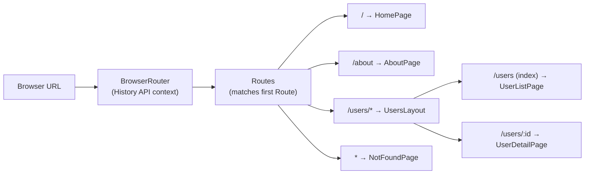

In a traditional website, every URL change triggers a server request for a new HTML page. In a React single-page application (SPA), the JavaScript bundle loads once and routing happens entirely in the browser — React Router swaps components in and out without a full page reload. This makes navigation feel instant and preserves application state across route changes.

## Why Client-side Routing

Without a routing library, every link click navigates to a new HTML file and the React app re-initializes from scratch. Client-side routing intercepts navigation events, updates the URL using the History API, and re-renders only the components that correspond to the new route — keeping global state, scroll position, and open connections intact.

## React Router v6 Basics

```tsx
import { BrowserRouter, Routes, Route, Link, Outlet } from "react-router-dom";

function App() {
  return (
    <BrowserRouter>
      <nav>
        <Link to="/">Home</Link>
        <Link to="/about">About</Link>
        <Link to="/users">Users</Link>
      </nav>
      <Routes>
        <Route path="/" element={<HomePage />} />
        <Route path="/about" element={<AboutPage />} />
        <Route path="/users" element={<UsersLayout />}>
          <Route index element={<UserListPage />} />
          <Route path=":userId" element={<UserDetailPage />} />
        </Route>
        <Route path="*" element={<NotFoundPage />} />
      </Routes>
    </BrowserRouter>
  );
}
```

- `BrowserRouter` provides the routing context using the browser's History API
- `Routes` renders only the first matching `Route`
- `Route path="*"` catches all unmatched paths — use it for 404 pages
- `<Link>` renders an `<a>` tag that navigates without a page reload

## Route Parameters with useParams

```tsx
// Route defined as: <Route path="/users/:userId" element={<UserDetailPage />} />

function UserDetailPage() {
  const { userId } = useParams<{ userId: string }>();
  const { data: user } = useFetch<User>(`/api/users/${userId}`);

  return <h1>{user?.name}</h1>;
}
```

> [!NOTE]
> `useParams` returns all URL parameters as strings — convert to numbers or other types before using them in API calls or comparisons.

## Programmatic Navigation with useNavigate

```tsx
function LoginForm() {
  const navigate = useNavigate();

  async function handleSubmit(credentials: Credentials) {
    await login(credentials);
    navigate("/dashboard", { replace: true }); // replace: true removes login from history
  }

  return <form onSubmit={handleSubmit}>...</form>;
}
```

`navigate(-1)` goes back one step; `navigate("/path", { state: { from: "login" } })` passes state through navigation.

## Nested Routes

React Router v6 uses nested `<Route>` elements with `<Outlet>` to render child routes inside a parent layout.

```tsx
function UsersLayout() {
  return (
    <div>
      <Sidebar /> {/* Always visible on /users/* routes */}
      <main>
        <Outlet /> {/* UserListPage or UserDetailPage renders here */}
      </main>
    </div>
  );
}
```

## Router Structure Diagram



## Protected Routes

A common pattern for requiring authentication before accessing certain routes:

```tsx
function ProtectedRoute({ children }: { children: React.ReactNode }) {
  const { user, isLoading } = useAuth();
  const location = useLocation();

  if (isLoading) return <Spinner />;

  if (!user) {
    // Redirect to login, preserving the attempted URL for post-login redirect
    return <Navigate to="/login" state={{ from: location }} replace />;
  }

  return <>{children}</>;
}

// Usage
<Route
  path="/dashboard"
  element={
    <ProtectedRoute>
      <DashboardPage />
    </ProtectedRoute>
  }
/>
```

After login, retrieve the redirect target: `const { state } = useLocation(); navigate(state?.from ?? "/")`.

> [!TIP]
> If you're using a meta-framework (Next.js, Remix, Astro), it provides its own routing system — you would not install React Router. React Router is for standalone React SPAs or Vite-based apps.

## Further Learning

Search these terms to go deeper:
- **"React Router v6 tutorial react.dev"** — the official tutorial covering all core concepts
- **"React Router useNavigate vs redirect"** — when to use each approach for programmatic navigation
- **"nested routes React Router v6"** — layout routes, index routes, and Outlet patterns
- **"TanStack Router"** — a type-safe alternative to React Router with first-class TypeScript support
- **"Next.js App Router vs React Router"** — understanding the difference between framework routing and library routing
