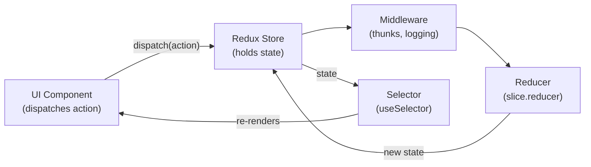

`useState` and Context handle a lot, but they have real limits in large applications: no devtools for time-travel debugging, no fine-grained subscriptions (context re-renders all consumers), no middleware for side effects, and no built-in async handling. State management libraries solve these problems.

## When You Need a Library

Signs you've outgrown `useState` and Context:
- **Many components** need to read or update the same state
- **Async logic** (thunks, sagas) is becoming complex to coordinate
- **Debugging is painful** — hard to trace what changed state and when
- **Performance** is suffering from context over-rendering
- **State changes need to trigger side effects** in a predictable pipeline

The two most popular solutions today are **Zustand** (simple, minimal boilerplate) and **Redux Toolkit** (feature-rich, opinionated, excellent devtools).

## Zustand

Zustand stores state in a plain JavaScript object outside React. Components subscribe to slices of that object and re-render only when the part they read changes.

```ts
// store.ts
import { create } from "zustand";

type CartState = {
  items: CartItem[];
  addItem: (item: CartItem) => void;
  removeItem: (id: string) => void;
  clearCart: () => void;
};

export const useCartStore = create<CartState>((set) => ({
  items: [],
  addItem: (item) =>
    set((state) => ({ items: [...state.items, item] })),
  removeItem: (id) =>
    set((state) => ({ items: state.items.filter((i) => i.id !== id) })),
  clearCart: () => set({ items: [] }),
}));
```

```tsx
// Any component — no Provider needed
function CartIcon() {
  const itemCount = useCartStore((state) => state.items.length);
  return <span>{itemCount}</span>;
}

function AddToCartButton({ product }: { product: Product }) {
  const addItem = useCartStore((state) => state.addItem);
  return <button onClick={() => addItem(product)}>Add to cart</button>;
}
```

The selector function (`state => state.items.length`) means `CartIcon` only re-renders when `itemCount` changes, not on any unrelated store update.

> [!TIP]
> Zustand requires zero configuration, no Provider wrapping, and the entire API fits in one file. It's an excellent default for small-to-medium apps where you just need shared state without ceremony.

## Redux Toolkit

Redux Toolkit (RTK) is the official, opinionated way to write Redux. It eliminates the historical pain of Redux: no more action type strings, no more manual reducer switch statements, no more separate action creators.

### The Redux Data Flow



### Creating a Slice

```ts
// features/todos/todosSlice.ts
import { createSlice, createAsyncThunk, PayloadAction } from "@reduxjs/toolkit";

type Todo = { id: string; text: string; done: boolean };
type TodosState = { items: Todo[]; status: "idle" | "loading" | "failed" };

// Async action (thunk) — handles loading/success/failure automatically
export const fetchTodos = createAsyncThunk("todos/fetchAll", async () => {
  const response = await fetch("/api/todos");
  return response.json() as Promise<Todo[]>;
});

const todosSlice = createSlice({
  name: "todos",
  initialState: { items: [], status: "idle" } as TodosState,
  reducers: {
    addTodo: (state, action: PayloadAction<string>) => {
      // Immer lets you "mutate" directly — it creates a new state under the hood
      state.items.push({ id: crypto.randomUUID(), text: action.payload, done: false });
    },
    toggleTodo: (state, action: PayloadAction<string>) => {
      const todo = state.items.find(t => t.id === action.payload);
      if (todo) todo.done = !todo.done;
    },
  },
  extraReducers: (builder) => {
    builder
      .addCase(fetchTodos.pending, (state) => { state.status = "loading"; })
      .addCase(fetchTodos.fulfilled, (state, action) => {
        state.status = "idle";
        state.items = action.payload;
      })
      .addCase(fetchTodos.rejected, (state) => { state.status = "failed"; });
  },
});

export const { addTodo, toggleTodo } = todosSlice.actions;
export default todosSlice.reducer;
```

```tsx
// In a component
import { useDispatch, useSelector } from "react-redux";
import { addTodo, fetchTodos } from "./todosSlice";

function TodoApp() {
  const dispatch = useDispatch();
  const { items, status } = useSelector((state: RootState) => state.todos);

  useEffect(() => { dispatch(fetchTodos()); }, [dispatch]);

  return (
    <div>
      {status === "loading" && <Spinner />}
      {items.map(todo => <TodoItem key={todo.id} todo={todo} />)}
      <button onClick={() => dispatch(addTodo("New task"))}>Add</button>
    </div>
  );
}
```

> [!NOTE]
> RTK uses **Immer** internally, so the "mutations" inside `createSlice` reducers are safe — Immer intercepts them and produces a new immutable state object. You can also use spread/return patterns if you prefer.

## Comparing the Two

| | Zustand | Redux Toolkit |
|---|---|---|
| Setup | `create()`, done | Store + slices + Provider |
| Boilerplate | Minimal | Moderate |
| Devtools | Plugin available | Excellent, built-in |
| Async | Handle manually | `createAsyncThunk` |
| Bundle size | ~1 KB | ~10 KB |
| Best for | Simple to medium apps | Large apps, complex async |

> [!CAUTION]
> Neither library replaces TanStack Query for **server state** (data fetched from an API). Server state has different concerns — caching, staleness, refetching — that neither Zustand nor Redux handle well out of the box. Use them together: TanStack Query for server data, Zustand/RTK for client UI state.

## Further Learning

Search these terms to go deeper:
- **"Zustand documentation pmndrs"** — the official Zustand docs with patterns for slices and middleware
- **"Redux Toolkit quick start redux-toolkit.js.org"** — the official RTK tutorial with TypeScript
- **"Kent C. Dodds application state management React"** — when to choose which tool
- **"Zustand vs Redux Toolkit 2024"** — community comparisons of tradeoffs in production
- **"TanStack Query vs Redux for server state"** — understanding the client/server state distinction
