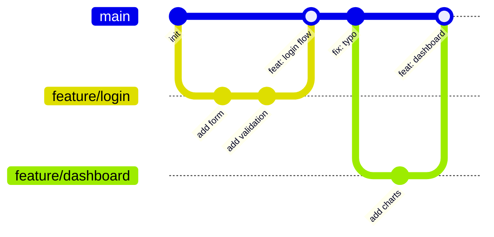

Git is a content-addressed object store disguised as a version-control tool. Understanding its internal model — rather than just memorising commands — lets you reason confidently about what any operation will do, recover from mistakes, and design workflows that scale to large teams.

## The Git Object Model

Everything Git stores is one of four object types, each identified by the SHA-1 hash of its content:

- **Blob** — the raw bytes of a single file revision. Two files with identical content share one blob.
- **Tree** — a directory listing: a sorted list of (mode, name, object-hash) entries pointing to blobs or other trees.
- **Commit** — a snapshot: a pointer to a root tree, zero or more parent commit hashes, author/committer metadata, and a message.
- **Tag** — an annotated pointer to any object, typically a commit.

A branch is just a file in `.git/refs/heads/` containing a single commit SHA. `HEAD` is a file containing either a branch name (attached) or a SHA (detached). When you commit, Git creates a blob for each changed file, constructs new trees, writes a commit object pointing to the root tree and the previous commit, and advances the branch pointer. Nothing is ever mutated — old objects stay forever (until garbage-collected).

```bash
# Inspect objects yourself
git cat-file -t HEAD        # "commit"
git cat-file -p HEAD        # shows tree hash, parent, author, message
git cat-file -p HEAD^{tree} # shows the root tree listing
```

## Branching Strategies

**Trunk-based development** keeps every developer's work within a day or two of `main`. Short-lived feature branches (or direct commits on main for small teams) are merged quickly, often gated by feature flags rather than waiting for a feature to be complete. CI must be fast and reliable. Google, Meta, and most high-velocity teams use this approach because it eliminates long-lived merge conflicts and keeps the history linear and readable.

**Gitflow** uses parallel long-lived branches: `main` (production), `develop` (integration), `feature/*`, `release/*`, and `hotfix/*`. It was designed for scheduled release cycles common in mobile apps and packaged software. The overhead of keeping `develop` and `main` synchronised makes it a poor fit for teams that deploy continuously.



## Conventional Commits

The [Conventional Commits](https://www.conventionalcommits.org/) specification gives commits a machine-readable structure:

```
<type>[optional scope]: <description>

[optional body]

[optional footer(s)]
```

Common types: `feat` (new feature), `fix` (bug fix), `docs`, `style`, `refactor`, `test`, `chore`, `perf`. A `!` after the type or a `BREAKING CHANGE:` footer signals a breaking change. This enables automated changelogs (`git cliff`, `semantic-release`) and makes `git log` scannable at a glance.

```bash
feat(auth): add OAuth2 Google login

Implement Google OAuth2 flow using the authorization code grant.
Stores access token in an HttpOnly cookie.

Closes #142
```

## Rebase vs Merge

Both integrate changes from one branch into another, but they produce different histories.

**Merge** creates a new merge commit with two parents. The branch topology is preserved — you can see exactly when and from where changes arrived. Good for preserving context on long-lived feature branches.

**Rebase** replays commits from the feature branch on top of the target, rewriting their SHAs. The result is a linear history that reads like work happened sequentially. Good for cleaning up messy local commits before opening a PR.

> [!WARNING]
> Never rebase commits that have been pushed to a shared branch. Rewriting history changes SHA hashes, causing `git pull` to fail for anyone who fetched those commits.

A common workflow: rebase locally to clean up, then merge (or squash-merge) to `main` via a pull request.

## Pull Request Workflow

1. Create a short-lived branch from `main`: `git switch -c feat/my-feature`
2. Commit early and often; use `git rebase -i` to tidy before review
3. Push and open a PR; write a description explaining the *why*, not just the *what*
4. CI runs automated checks (lint, type-check, tests)
5. Reviewers leave comments; address or discuss each one
6. Squash or rebase-merge to keep `main` clean
7. Delete the feature branch immediately after merging

> [!TIP]
> Keep PRs small — under 400 lines of diff is a good target. Reviewers give better feedback on focused changes, and small PRs merge faster with fewer conflicts.

## Further Learning

Search these terms to go deeper:
- **"Conventional Commits specification"** — the full spec with examples and tooling ecosystem
- **"trunk-based development Forsgren Humble Kim"** — the research backing trunk-based workflows from *Accelerate*
- **"Git internals plumbing porcelain"** — the Pro Git book chapter that explains the object model in depth
- **"git rebase interactive tutorial"** — hands-on practice squashing, reordering, and editing commits
- **"semantic-release GitHub Actions"** — automating versioning and changelogs from Conventional Commits
