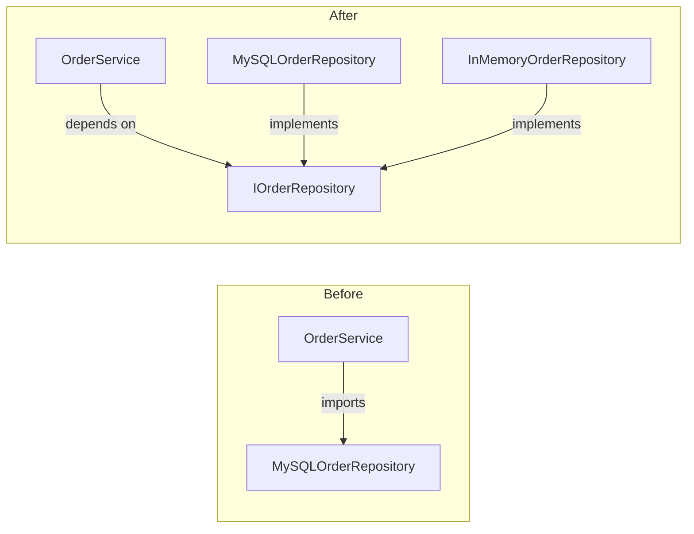

SOLID is a mnemonic for five object-oriented design principles introduced by Robert C. Martin in the early 2000s. They are guidelines, not laws — applied judiciously, they produce code that is easier to change without unintended side effects. Applied dogmatically, they produce over-engineered abstractions. The goal is always changeability: code that is easy to understand, test, and modify.

## S — Single Responsibility Principle

> A class should have only one reason to change.

"Reason to change" means the stakeholder or actor whose requirements would force a modification. A class that handles business logic *and* formats HTML output will need changes whenever either the business rules or the display format evolve — two reasons.

```ts
// Bad: UserService handles business logic AND email formatting
class UserService {
  async register(email: string, password: string): Promise<void> {
    const user = await this.db.create({ email, password });
    const html = `<h1>Welcome ${user.email}</h1><p>Thanks for joining!</p>`;
    await this.mailer.send({ to: email, body: html });
  }
}

// Good: email rendering is its own concern
class WelcomeEmailTemplate {
  render(user: User): string {
    return `<h1>Welcome ${user.email}</h1><p>Thanks for joining!</p>`;
  }
}

class UserService {
  async register(email: string, password: string): Promise<void> {
    const user = await this.db.create({ email, password });
    const body = this.emailTemplate.render(user);
    await this.mailer.send({ to: email, body });
  }
}
```

## O — Open/Closed Principle

> Software entities should be open for extension, but closed for modification.

New behaviour should be addable without editing existing, tested code. The classic mechanism is polymorphism: define an abstraction and add new behaviour by adding new implementations.

```ts
// Bad: adding a new discount type requires modifying calculateDiscount
function calculateDiscount(user: User): number {
  if (user.type === "premium") return 0.2;
  if (user.type === "student") return 0.1;
  return 0; // Must edit this function to add "senior" discount
}

// Good: each discount rule is a separate strategy
interface DiscountRule {
  applies(user: User): boolean;
  discount(): number;
}

class PremiumDiscount implements DiscountRule {
  applies(user: User) { return user.type === "premium"; }
  discount() { return 0.2; }
}

class StudentDiscount implements DiscountRule {
  applies(user: User) { return user.type === "student"; }
  discount() { return 0.1; }
}

// Adding "senior" = adding a new class, zero existing code changed
function calculateDiscount(user: User, rules: DiscountRule[]): number {
  return rules.find(r => r.applies(user))?.discount() ?? 0;
}
```

## L — Liskov Substitution Principle

> Subtypes must be substitutable for their base types without altering program correctness.

Barbara Liskov formalised this in 1987. If a function works with a `Bird`, it must also work correctly with any `Bird` subclass. A subclass that throws when a method is called, silently ignores a contract, or changes preconditions violates LSP — even if the TypeScript compiler accepts it.

```ts
// Bad: Square violates the Rectangle contract
class Rectangle {
  constructor(protected width: number, protected height: number) {}
  setWidth(w: number) { this.width = w; }
  setHeight(h: number) { this.height = h; }
  area() { return this.width * this.height; }
}

class Square extends Rectangle {
  setWidth(w: number) { this.width = this.height = w; } // Breaks caller expectations
  setHeight(h: number) { this.width = this.height = h; }
}

// Good: no inheritance; model the domain honestly
interface Shape { area(): number; }
class Rectangle implements Shape { ... }
class Square implements Shape { ... }
```

> [!NOTE]
> The LSP violation test: write a function that accepts the base type and verify it behaves correctly when passed every subtype. If any subtype breaks the function, LSP is violated.

## I — Interface Segregation Principle

> Clients should not be forced to depend on interfaces they do not use.

Fat interfaces force implementors to provide methods that are irrelevant to them, often as empty stubs or thrown exceptions — a sign the interface models too many roles at once.

```ts
// Bad: a read-only report source is forced to implement write methods
interface DataStore {
  read(id: string): Promise<Record<string, unknown>>;
  write(id: string, data: unknown): Promise<void>;
  delete(id: string): Promise<void>;
}

class ReportDataSource implements DataStore {
  read(id: string) { return this.db.query(id); }
  write() { throw new Error("Read-only!"); }   // forced stub
  delete() { throw new Error("Read-only!"); }  // forced stub
}

// Good: split by role
interface Readable { read(id: string): Promise<Record<string, unknown>>; }
interface Writable { write(id: string, data: unknown): Promise<void>; }
interface Deletable { delete(id: string): Promise<void>; }

class ReportDataSource implements Readable {
  read(id: string) { return this.db.query(id); }
}
```

## D — Dependency Inversion Principle

> High-level modules should not depend on low-level modules. Both should depend on abstractions.

When a high-level business rule directly instantiates a low-level detail (a specific database driver, a concrete HTTP client), it becomes tightly coupled — you cannot test or replace the detail without touching the rule.



```ts
// Bad: high-level service hard-codes the low-level detail
class OrderService {
  private repo = new MySQLOrderRepository(); // tight coupling
  async placeOrder(order: Order) {
    await this.repo.save(order);
  }
}

// Good: depend on an abstraction; inject the concrete implementation
interface IOrderRepository {
  save(order: Order): Promise<void>;
  findById(id: string): Promise<Order | null>;
}

class OrderService {
  constructor(private repo: IOrderRepository) {}
  async placeOrder(order: Order) {
    await this.repo.save(order);
  }
}

// In tests: inject InMemoryOrderRepository
// In production: inject MySQLOrderRepository
```

> [!TIP]
> DIP is what makes unit testing possible without hitting real databases. It is also the foundation of dependency injection containers used by frameworks like NestJS and Angular.

## Further Learning

Search these terms to go deeper:
- **"Clean Architecture Robert C. Martin"** — extends SOLID into an architectural philosophy with layered boundaries
- **"SOLID principles TypeScript examples"** — many practical walkthroughs in the TypeScript ecosystem
- **"Liskov Substitution Principle Barbara Liskov 1987"** — the original paper: "Data Abstraction and Hierarchy"
- **"dependency injection NestJS"** — a production-grade framework built on DIP
- **"SOLID critique Dan North"** — a thoughtful counterpoint arguing for simpler heuristics
