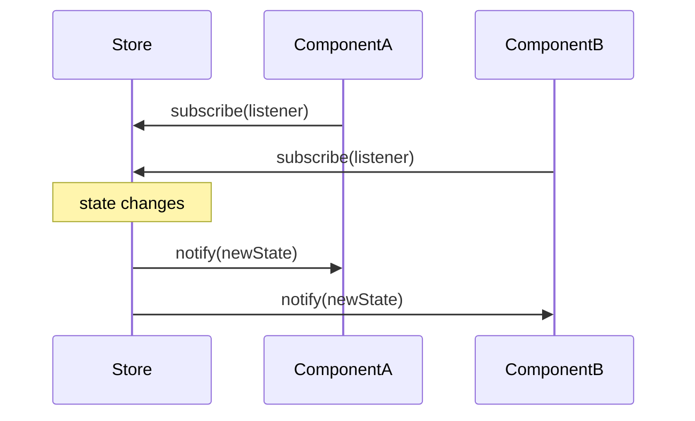

Behavioral patterns define how objects communicate and collaborate. They shift focus from structure to *flow* — how responsibilities are distributed, how algorithms are encapsulated, how sequences are traversed. Several behavioral patterns are so deeply embedded in JavaScript that developers use them daily without recognising them: the event listener model *is* Observer, `for...of` *is* Iterator, and `Array.prototype.map` *is* a consumer of the Iterator protocol.

## Observer

**Problem:** when one object changes state, an unknown number of other objects need to react — but the source should not be coupled to those dependents.

**Solution:** define a Subject that maintains a list of Observers. Observers register interest; the Subject notifies all of them when it changes.



```ts
type Listener<T> = (value: T) => void;

class Observable<T> {
  private listeners = new Set<Listener<T>>();
  private value: T;

  constructor(initial: T) { this.value = initial; }

  subscribe(fn: Listener<T>): () => void {
    this.listeners.add(fn);
    return () => this.listeners.delete(fn); // returns unsubscribe
  }

  set(newValue: T) {
    this.value = newValue;
    this.listeners.forEach(fn => fn(newValue));
  }

  get() { return this.value; }
}

const count = new Observable(0);
const unsub = count.subscribe(v => console.log("count:", v));
count.set(1); // count: 1
count.set(2); // count: 2
unsub();      // unsubscribed — no more logs
```

> [!NOTE]
> `EventTarget.addEventListener` is Observer built into the browser. React's `useState` + `useEffect`, Nanostores, Zustand, and RxJS Observables are all variations on this pattern. The key insight is that the Subject owns the *what changed* but not the *what to do about it*.

## Strategy

**Problem:** a class needs to perform a task that can be done in several ways, and the algorithm should be swappable at runtime.

**Solution:** define a Strategy interface for the algorithm family and inject a concrete Strategy into the Context class.

```ts
interface SortStrategy<T> {
  sort(data: T[]): T[];
}

class QuickSort<T> implements SortStrategy<T> {
  sort(data: T[]) { return [...data].sort(); } // simplified
}

class BucketSort<T extends number> implements SortStrategy<T> {
  sort(data: T[]) { /* bucket sort impl */ return data; }
}

class DataGrid<T> {
  constructor(
    private data: T[],
    private strategy: SortStrategy<T>
  ) {}

  setStrategy(s: SortStrategy<T>) { this.strategy = s; }
  render() { return this.strategy.sort(this.data); }
}

const grid = new DataGrid([3, 1, 2], new QuickSort());
grid.render(); // [1, 2, 3]
grid.setStrategy(new BucketSort());
grid.render(); // also [1, 2, 3], different algorithm
```

Strategy is everywhere in production TypeScript: authentication strategies in Passport.js, sorting/filtering logic in table components, validation schemas, and form submission handlers.

## Command

**Problem:** you want to encapsulate a request as an object so you can queue it, log it, undo it, or retry it.

**Solution:** define a Command interface with `execute()` (and optionally `undo()`). A CommandHistory can maintain a stack of executed commands.

```ts
interface Command {
  execute(): void;
  undo(): void;
}

class TextEditor {
  private content = "";
  getContent() { return this.content; }
  insert(text: string) { this.content += text; }
  delete(n: number) { this.content = this.content.slice(0, -n); }
}

class InsertCommand implements Command {
  constructor(private editor: TextEditor, private text: string) {}
  execute() { this.editor.insert(this.text); }
  undo() { this.editor.delete(this.text.length); }
}

class History {
  private stack: Command[] = [];
  execute(cmd: Command) { cmd.execute(); this.stack.push(cmd); }
  undo() { this.stack.pop()?.undo(); }
}

const editor = new TextEditor();
const history = new History();
history.execute(new InsertCommand(editor, "Hello"));
history.execute(new InsertCommand(editor, " World"));
// editor.getContent() === "Hello World"
history.undo();
// editor.getContent() === "Hello"
```

> [!TIP]
> Ctrl+Z in every text editor, spreadsheet, and graphic tool is implemented with Command + History. In frontend state management, Redux actions are Commands — pure data objects describing what happened, applied to state by reducers.

## Iterator

**Problem:** you want to traverse a collection without exposing its internal structure (array, linked list, tree, database cursor).

**Solution:** define an Iterator with `next()` returning `{ value, done }`. In JavaScript/TypeScript this is the **built-in Iterator protocol** — any object with a `[Symbol.iterator]()` method works with `for...of`, spread, destructuring, and `Array.from`.

```ts
class Range {
  constructor(private start: number, private end: number) {}

  [Symbol.iterator]() {
    let current = this.start;
    const end = this.end;
    return {
      next(): IteratorResult<number> {
        if (current <= end) {
          return { value: current++, done: false };
        }
        return { value: undefined as unknown as number, done: true };
      }
    };
  }
}

const range = new Range(1, 5);
for (const n of range) console.log(n); // 1 2 3 4 5
const arr = [...range]; // [1, 2, 3, 4, 5]
```

Generators (`function*`) are syntax sugar for implementing iterators without the boilerplate. Node.js streams, the DOM NodeList, `Map`, `Set`, and `String` are all iterable natively.

> [!NOTE]
> JavaScript also has **AsyncIterator** (`[Symbol.asyncIterator]`) for `for await...of` loops, used in streaming APIs, database cursors, and async generators — the same pattern, extended for asynchronous sequences.

## Further Learning

Search these terms to go deeper:
- **"Design Patterns GoF behavioral chapter"** — the original Observer, Strategy, Command, Iterator, plus Chain of Responsibility, Mediator, Memento, State, Template Method, Visitor
- **"JavaScript Iterator protocol MDN Symbol.iterator"** — the native protocol and how to implement custom iterables
- **"Redux architecture command pattern"** — how Redux actions, reducers, and middleware map to Command + History
- **"RxJS reactive programming Observer"** — Observer taken to its logical extreme with composable pipelines
- **"Passport.js strategy pattern"** — real-world Strategy: pluggable authentication algorithms
