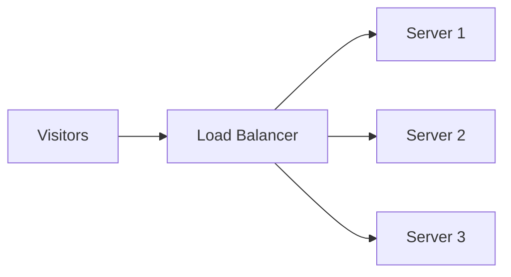

When one server can't handle all your traffic, you add more servers. But now — which one should each visitor talk to? A **load balancer** is the traffic cop that stands in front and spreads requests evenly across your servers.

## The setup

Every request hits the load balancer first, and it decides which server handles it. This lets you **scale out** — handle more users by adding cheap servers, instead of buying one giant expensive machine.

## How it decides

Two common approaches:

- **Round-robin** — take turns: server 1, then 2, then 3, then back to 1. Simple and fair.
- **Least-connections** — send each request to whichever server is currently *least* busy. Smarter when some requests take longer than others.

## Bonus: it handles dead servers

The load balancer regularly pings each server with a **health check** ("you alive?"). If a server stops responding, the balancer quietly stops sending traffic to it — so one crashed machine doesn't break your site. Users never notice.

## In one sentence

A load balancer sits in front of multiple servers and spreads incoming requests across them (round-robin or least-busy), letting you scale by adding servers — and it routes around any server that fails its health check.

## Want to go deeper?

Switch to **Expert** mode above for more on strategies and health-check behavior.
