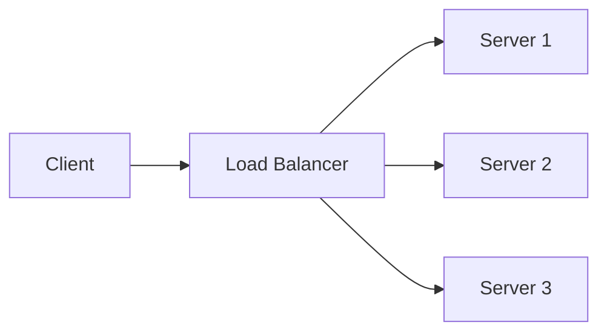

A **load balancer** sits in front of several identical servers and spreads
incoming requests across them. It's how you scale **horizontally** — add more
machines instead of buying a bigger one.

## Common strategies

- **Round-robin** — hand each new request to the next server in turn.
- **Least-connections** — send to whichever server is currently least busy.

> [!TIP]
> A load balancer runs **health checks** and quietly stops routing to any server
> that fails them, so one dead machine doesn't take down your service.
