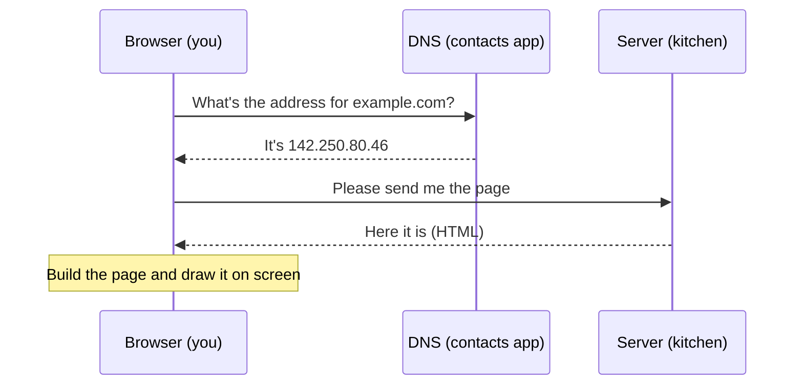

Think of visiting a web page like ordering food at a restaurant. You (the browser) ask for something, a kitchen (the server) makes it, and it comes back to your table. Let's walk through what actually happens — step by step, in plain language.

## Who talks to who: the client and the server

There are two roles on the web:

- The **client** is the thing that asks — usually your browser (Chrome, Safari, etc.).
- The **server** is the computer that answers, sending back the page.

The client always asks first. The server just waits and replies. Two browsers never talk to each other directly — everything goes through a server in the middle, like customers ordering through the kitchen rather than cooking for each other.

## Step 1 — Finding the address (DNS)

You type a name like `example.com`, but computers actually find each other using numbers called IP addresses (like a phone number for a computer). Something needs to turn the name into the number.

That job belongs to **DNS**, which works like the internet's contacts app: you give it a name, it gives you back the number. Your browser asks, "What's the address for example.com?" and DNS answers with something like `142.250.80.46`. This usually takes a fraction of a second, and the answer is remembered for a while so it doesn't have to be looked up every time.

## Step 2 — Making a connection (TCP/IP)

Now that your browser knows the address, it needs to open a reliable line to that server — like dialing the number and waiting for someone to pick up.

**TCP/IP** is the system that carries your data across the internet. It chops the data into small pieces, sends them, and makes sure they all arrive in the right order with nothing missing. If the site uses **HTTPS** (the secure padlock version), an extra step sets up encryption so nobody in between can read what's sent.

## Step 3 — Asking for the page (HTTP)

With the line open, your browser sends a **request**: basically a polite note saying "please give me this page." The server reads it and sends back a **response**: the page itself, plus a little status label saying whether it worked.

You'll often see status numbers: `200` means "OK, here you go," and `404` means "I couldn't find that."

## Step 4 — Drawing the page (rendering)

The server sends back **HTML** — the text and structure of the page. Your browser reads it and builds an internal map of the page called the **DOM**. It also downloads the **CSS** (which controls colors and layout) and any **JavaScript** (which adds interactivity), then paints everything onto your screen.

> [!TIP]
> Want to see it happen? Open your browser's DevTools (right-click → Inspect → "Network" tab) and reload a page. You'll watch each step above happen in real time.

## In one sentence

You ask for a page by name, DNS turns the name into an address, your browser opens a secure line to that address, asks for the page with HTTP, and then draws what comes back. That's the whole web in a nutshell.

## Want to go deeper?

When you're ready, switch to **Expert** mode above to read the full technical version with the exact protocols and handshakes.
