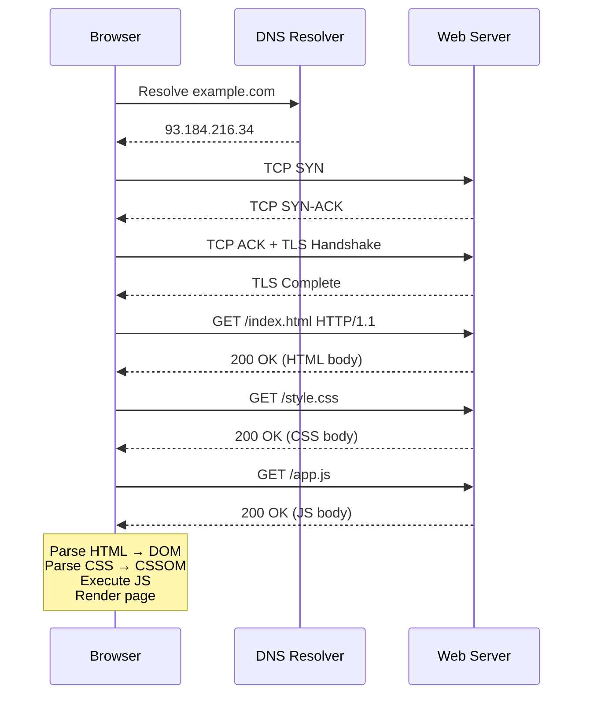

Every time you visit a web page, a small but precise choreography takes place between your browser, several servers, and the global networking infrastructure. Understanding this sequence is foundational — it explains caching, HTTPS, latency, and dozens of other concepts you will encounter constantly as a web developer.

## The Client-Server Model

The web is built on a simple split of responsibilities. A **client** (usually a browser) initiates requests; a **server** listens for those requests and sends back responses. Neither side can exist without the other. Clients never push unsolicited data to each other directly — all communication flows through servers.

## DNS: Translating Names to Addresses

Computers on the internet are addressed by IP addresses like `142.250.80.46`. Humans use domain names like `example.com`. The **Domain Name System (DNS)** is the distributed phonebook that translates one to the other.

When you type `https://example.com`:
1. Your browser checks its own DNS cache.
2. If not found, it asks your operating system, which checks its cache.
3. If still not found, a query goes to a **recursive resolver** (usually provided by your ISP or a service like `1.1.1.1`).
4. The resolver asks the **root nameservers**, which point it to the `.com` top-level-domain servers.
5. Those point to `example.com`'s authoritative nameserver, which returns the IP.

This whole process typically takes 10–50 ms and the result is cached aggressively to avoid repeating it.

## TCP/IP: Reliable Packet Delivery

Once the browser has an IP address it opens a **TCP connection**. TCP (Transmission Control Protocol) breaks data into packets, sends them over IP (Internet Protocol), and guarantees they arrive in order with no data lost. Before any data is exchanged, a **three-way handshake** occurs: SYN → SYN-ACK → ACK. HTTPS adds a **TLS handshake** on top to establish encryption.

## HTTP: The Application Protocol

With a connection open, the browser sends an **HTTP request** — a plain-text (or, in HTTP/2, binary-framed) message specifying a method, a path, headers, and an optional body. The server processes it and returns an **HTTP response** with a status code, headers, and a body.

```http
GET /index.html HTTP/1.1
Host: example.com
Accept: text/html
```

```http
HTTP/1.1 200 OK
Content-Type: text/html; charset=utf-8
Content-Length: 1234

<!doctype html>...
```

## Browser Rendering

Once the HTML arrives the browser parses it into the **DOM** (Document Object Model), fetches linked CSS and JavaScript files, builds the **CSSOM**, combines them into a **render tree**, performs **layout** (computing positions and sizes), and finally **paints** pixels to the screen. JavaScript can block this pipeline, which is why `<script>` tags are often placed at the end of `<body>` or marked `defer`.



> [!TIP]
> Open your browser's DevTools Network tab and reload any page. You can watch every single step above happen in real time: DNS lookup, TCP connect, TLS, TTFB (time to first byte), and asset downloads are all shown with timing breakdowns.

> [!NOTE]
> HTTP/2 and HTTP/3 improve on HTTP/1.1 by multiplexing many requests over a single connection (HTTP/2) or using UDP instead of TCP (HTTP/3 via QUIC), but the request/response concept and status codes remain the same.

## Further Learning

Search these terms to go deeper:
- **"HTTP/1.1 vs HTTP/2 vs HTTP/3"** — how each version improved on the last and what QUIC is
- **"TLS handshake explained"** — how HTTPS establishes a secure, encrypted channel
- **"Critical rendering path browser"** — the detailed sequence from HTML bytes to painted pixels
- **"DNS TTL caching"** — how long DNS responses are cached and why it matters for deployments
- **"TCP three-way handshake"** — the exact SYN/SYN-ACK/ACK sequence and why TCP needs it
