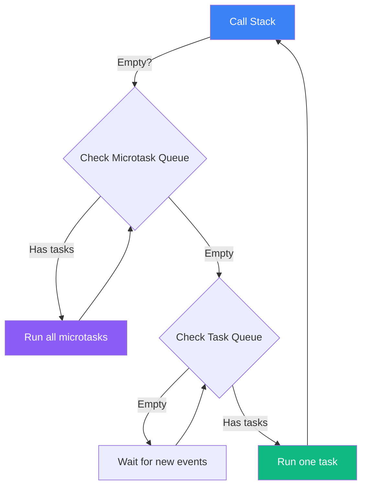

Events are the heartbeat of interactive web pages. Every click, keypress, scroll, and network response is an event that can trigger JavaScript code. Understanding how events propagate through the DOM — and how JavaScript's event loop schedules their handlers — is essential for writing code that is both correct and responsive.

## addEventListener

```ts
const button = document.querySelector<HTMLButtonElement>('#submit')!

// Add a listener
function handleClick(event: MouseEvent) {
  console.log('Clicked at:', event.clientX, event.clientY)
}
button.addEventListener('click', handleClick)

// Remove a listener — must pass the SAME function reference
button.removeEventListener('click', handleClick)

// Options
button.addEventListener('click', handleClick, {
  once: true,     // remove automatically after first call
  passive: true,  // hints to browser that preventDefault won't be called (perf)
  capture: false, // whether to listen in capture phase (default: false = bubble)
})
```

> [!WARNING]
> Arrow functions defined inline — `button.addEventListener('click', () => {...})` — cannot be removed with `removeEventListener` because each expression creates a new function object. Store the handler in a variable if you need to remove it later.

## Bubbling and Capturing

When an event fires on an element, it travels through the DOM in three phases:

1. **Capture phase** — from `document` down to the target element.
2. **Target phase** — at the target element itself.
3. **Bubble phase** — from the target element back up to `document`.

By default, listeners use the bubble phase. Most events bubble (click, input, keydown), but some do not (focus, blur — though `focusin`/`focusout` do bubble).

```ts
document.addEventListener('click', e => {
  console.log('Capture phase: document saw click first')
}, { capture: true })

document.querySelector('.parent')!.addEventListener('click', e => {
  console.log('Bubble phase: parent saw click after target')
})
```

## Event Delegation

Instead of attaching a listener to every list item individually, attach one listener to the parent and check which child was the actual target. This is more memory-efficient and works for dynamically added elements:

```ts
const list = document.querySelector<HTMLUListElement>('#todo-list')!

list.addEventListener('click', (event: MouseEvent) => {
  // Find the closest ancestor (or self) matching the selector
  const item = (event.target as Element).closest('li.todo-item')
  if (!item) return  // click was somewhere else in the list

  item.classList.toggle('done')
  console.log('Toggled item:', item.dataset.id)
})

// This listener handles ALL list items, including ones added later
const newItem = document.createElement('li')
newItem.className = 'todo-item'
newItem.dataset.id = '99'
newItem.textContent = 'Buy coffee'
list.appendChild(newItem)  // ← automatically handled by the delegation listener above
```

## preventDefault and stopPropagation

```ts
// Prevent the browser's default action (form submit, link navigation, etc.)
form.addEventListener('submit', (event: SubmitEvent) => {
  event.preventDefault()  // don't navigate to form action URL
  // handle with fetch instead
})

anchor.addEventListener('click', (event: MouseEvent) => {
  event.preventDefault()  // don't follow the href
  router.navigate(anchor.href)
})

// Stop the event from bubbling further up the DOM
innerButton.addEventListener('click', (event: MouseEvent) => {
  event.stopPropagation()  // parent listeners won't fire for this click
})

// stopImmediatePropagation also prevents other listeners on the SAME element
```

> [!CAUTION]
> Overusing `stopPropagation` makes event delegation impossible higher up in the tree and can break third-party scripts that rely on bubbling. Prefer `event.target` checks with `closest()` over stopping propagation.

## The Event Loop

JavaScript is **single-threaded** — it can only do one thing at a time. The event loop is the mechanism that schedules all work. Understanding it explains why `setTimeout` does not guarantee exact timing and why long loops freeze the page.



- **Call stack** — where synchronous code executes. Only one frame runs at a time.
- **Task queue (macrotask queue)** — holds callbacks from `setTimeout`, `setInterval`, DOM events, and I/O. The event loop picks one task per iteration.
- **Microtask queue** — holds Promise `.then`/`.catch` callbacks and `queueMicrotask`. Microtasks drain completely before the next task runs.

```ts
console.log('1 — sync')

setTimeout(() => console.log('4 — task'), 0)

Promise.resolve()
  .then(() => console.log('2 — microtask'))
  .then(() => console.log('3 — microtask'))

console.log('5 — sync')

// Output: 1 — sync → 5 — sync → 2 — microtask → 3 — microtask → 4 — task
```

> [!NOTE]
> `setTimeout(fn, 0)` does not run `fn` immediately. It schedules a task, which runs after all currently queued microtasks and after the browser has had a chance to paint. The actual delay is typically 4–16 ms.

## Further Learning

Search these terms to go deeper:
- **"JavaScript event loop Philip Roberts"** — the classic "What the heck is the event loop?" conference talk (excellent visual explanation)
- **"event delegation patterns"** — why large interactive lists should always use delegation
- **"microtask vs macrotask JavaScript"** — detailed breakdown of the two queues and their priority
- **"passive event listeners web.dev"** — how `passive: true` improves scroll performance
- **"CustomEvent API"** — how to dispatch and listen for your own typed events between components
